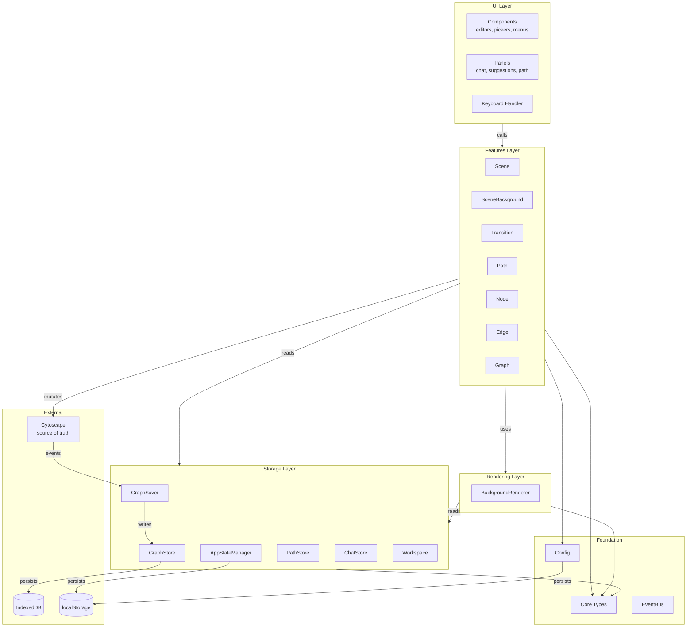

# Knogra Architecture
**Updated:** January 26, 2026

> **⚠ Under review (April 2026).**
> Sections 1–2 (Core Philosophy and Lexicon) include vocabulary —
> particularly *Included* vs *Visible*, *Scene*, *Fold* — that is being
> consolidated into [`scene-transitions.md`](scene-transitions.md). Once
> that document stabilizes, vocabulary authority moves there and this doc
> will reference it. Other sections remain authoritative.

## Section 1. Core Philosophy

**Modular layered architecture with vertical feature organization.**

The app is structured in **horizontal layers** at the top level (UI, Features, Rendering, Storage) with clear separation of concerns and dependencies flowing downward. Within the **Features layer**, we use **vertical slicing** — each feature (Scene, SceneBackground, Node, Edge, Graph, Transition, Path) is self-contained with its own utilities and logic, independent of other features.

This hybrid approach combines:
- **Layered architecture:** Clear boundaries, testability, predictable data flow
- **Vertical features:** Domain-focused modules, easy to understand and modify, minimal coupling

Each feature is a complete vertical slice that coordinates with Cytoscape but doesn't depend on other features.

**Unidirectional data flow:**
```
UI → Features → Cytoscape → GraphSaver → Database
```

Cytoscape is the core component responsible for manipulation and presentation of scenes. The current/real-time state of the scene is tracked by Cytoscape (not by any other state management system). Cytoscape is the **source of truth** for graph state.

---

## Section 2. Lexicon

### Graph vs Scene
**Graph** — The complete knowledge graph stored in the database. Contains all nodes and edges that exist, regardless of visibility.

**Scene** — A curated view/perspective on the graph. Defines:
- Which nodes and edges to display
- Where to position each node
- How to style each node (design, scale)
- Viewport settings (zoom, pan)
- Background images
- Fold state (which subtrees are collapsed)

**Key insight:** The same node can appear in multiple scenes with different positions and styles.

### Included vs Visible
A node's relationship to a scene has two distinct levels:

**Included** — The node is an element of the scene (stored in the scene's database record under `scene.nodes`). It exists in Cytoscape when the scene is loaded, but may be hidden.

**Visible** — The node is included AND not folded (hidden). It is rendered on screen and the user can see and interact with it.

This distinction matters for transition routing: a morph transition requires the target scene's central node to be **visible** (not merely included) in the current scene. A folded node has no visual presence to morph from, so the close+open path is used instead.

### Scene vs SceneBackground
**Scene** — Manages the **graph layer** (nodes, edges, positions, styles via Cytoscape)
**SceneBackground** — Manages the **canvas layer** (background images via BackgroundRenderer)

These are peer features with distinct responsibilities.

### Path
**Path** — A sequence of scenes produced by user navigation. May exist in-memory during a session or be persisted for later replay. Analogous to how Scene or Node can be in-memory or stored.

### Workspace
**Workspace** — Complete application state bundle exported as a `.knogra` file. Includes:
- Graph data (nodes, edges, scenes, background images)
- Settings (user preferences)
- Chat history (AI conversations)
- Saved paths
- App state (last scene)

### Shelf
**Shelf** — Collection of AI-suggested nodes waiting to be placed on the graph. Managed by NodeShelf, displayed by SuggestionPanel.

### Operation Verbs
To distinguish between graph operations and scene operations:

| Scope | Verbs | Examples |
|-------|-------|----------|
| **Graph** (database) | Add, Delete, Create, Update | `addNode()`, `deleteEdge()` |
| **Scene** (view) | Include, Exclude, Expand, Collapse, Show, Hide | `includeNode()`, `excludeEdge()` |
| **Fold** (visibility) | Fold, Unfold | `foldNode()`, `unfoldNode()` |

**Note:** Operations can be bundled — e.g., `addChild()` creates a node in the database AND includes it in the current scene.

---

## Section 3. Architecture Layers

### 3.1 Layer Overview



**Dependency direction:** UI → Features → Rendering/Storage → Core

### 3.2 Foundation Layers

#### Core (`src/core/`)
Type definitions and interfaces. **No logic.**

| File | Purpose |
|------|---------|
| `main-types.ts` | Node, Edge, Scene, Path, Graph types |
| `background-types.ts` | Background image and filter types |
| `design-types.ts` | Node/edge design system types |
| `store-types.ts` | Database interface types |

#### Config (`src/config/`)
Application settings and user preferences.

| File | Purpose |
|------|---------|
| `index.ts` | `getSetting()` facade |
| `storage-config.ts` | Database names, keys, schemas |
| `setting-definitions.ts` | All configurable settings with defaults |
| `transition-settings.ts` | Animation timing configurations |
| `ai-settings.ts` | AI provider settings |

**Storage:** Persisted to localStorage with `knogra.` prefix.

### 3.3 Storage Layer (`src/storage/`)

#### Graph Persistence

**GraphStore** (`graph-store.ts`)
- Interface to IndexedDB via Dexie
- In-memory cache of nodes, edges, scenes, backgroundImages
- CRUD operations: `createNode()`, `updateNode()`, `deleteNode()`, etc.
- **Read by:** Features, UI, Rendering (for lookups)
- **Written by:** GraphSaver only

**GraphSaver** (`graph-saver.ts`)
- Listens to Cytoscape events: `add`, `remove`, `data`, `free`, `viewport`
- Debounced auto-save (500ms delay)
- Extracts state from Cytoscape → writes to GraphStore
- Handles deletion queue (nodes/edges marked for deletion)

#### Session State

**AppStateManager** (`app-state.ts`)
- Manages session state in localStorage (`knogra.state`)
- Tracks last opened scene
- Listens to `scene:changed` events
- Static class with `getLastSceneId()`, `saveLastSceneId()`, `clearAppState()`

#### Auxiliary Stores

**PathStore** (`path-store.ts`)
- Separate IndexedDB (`knogra-paths`) for saved navigation paths
- In-memory cache + CRUD operations
- Independent from GraphStore

**ChatStore** (`chat-store.ts`)
- Separate IndexedDB (`knogra-chat`) for AI conversations
- Conversations keyed by `nodeId`

#### Workspace

**Workspace** (`workspace.ts`)
- Export/import complete workspace as `.knogra` ZIP file
- Works directly with storage layers (not via store classes)
- Collects: graph, settings, chat, paths, backgrounds, app-state
- Handles validation and restoration on import

### 3.4 Rendering Layer (`src/rendering/`)

**BackgroundRenderer** (`background-renderer.ts`)
- Canvas layer for scene background images
- Positioned behind Cytoscape (z-index: 0)
- Images positioned in graph coordinates
- Transforms with zoom/pan events
- Injected into features that need it (SceneBackground, Transition)

**Design rationale:** Separates background rendering from Cytoscape's graph rendering. Allows independent optimization and cleaner feature boundaries.

### 3.5 Features Layer (`src/features/`)

#### Feature Organization Patterns

**Small features** (single file):
```
node.ts         # All logic in one class
edge.ts
graph.ts
scene-background.ts
```

**Large features** (folder with utilities):
```
scene/
  scene.ts        # Main feature class
  traversal.ts    # Feature-owned pure utilities
  elements.ts     # Element management helpers
  viewport.ts     # Viewport calculations

transition/
  transition.ts   # Main orchestrator
  stage-animator.ts  # Animation stage helpers (subclass)
  scene-factory.ts   # Scene creation utilities

path/
  path.ts         # Main feature class
  history.ts      # Navigation history logic
```

**Subclass extraction pattern:**
When a feature has many related methods sharing dependencies, extract them into a helper class (not pure functions). The helper class holds shared state (`cy`, `container`, `renderer`), while the main feature class orchestrates.

Example: `StageAnimator` in `transition/`
- Holds: `#cy`, `#container`, `#backgroundRenderer`
- Provides: `fadeOutEdges()`, `flyOutNodes()`, `moveNodes()`, etc.
- Transition orchestrates stage sequence, StageAnimator executes each stage

**Shared utilities** (`features/utils/`):
Used by 2+ features. Split by purity:

| Type | Location | Rules |
|------|----------|-------|
| Pure | `utils/pure/` | No side effects, no Cytoscape access |
| Cy-mutating | `utils/cy/` | Accept `cy` as parameter |

**Dependency rules:**
```
Features (scene.ts, node.ts, etc.)
  ↓ can use
Shared Utils (utils/cy/, utils/pure/)
  ↓ can use
Core Types only

❌ Shared utils CANNOT import from features
❌ Pure utils CANNOT import cy utilities
```

#### Feature Catalog

| Feature | Location | Purpose |
|---------|----------|---------|
| **Scene** | `scene/scene.ts` | Graph layer: node/edge composition, positions, styles (via Cytoscape) |
| **SceneBackground** | `scene-background.ts` | Canvas layer: background images (via BackgroundRenderer) |
| **Node** | `node.ts` | Node design and content operations |
| **Edge** | `edge.ts` | Edge design and content operations |
| **Graph** | `graph.ts` | Graph construction: add/delete nodes and edges |
| **Transition** | `transition/transition.ts` | Animated scene-to-scene navigation |
| **Path** | `path/path.ts` | Navigation history tracking and persistence |

**FeatureAPI** (`feature-api.ts`) — Facade exposing all features. No business logic.

### 3.6 Events Layer (`src/events/`)

**EventBus** (`event-bus.ts`)
- Typed publish/subscribe for cross-module communication
- Enables unidirectional data flow: Graph System → AI System

**Cytoscape Custom Events:**

| Event | Payload | Emitted by | Consumed by |
|-------|---------|------------|-------------|
| `scene:changed` | `sceneId` | Transition | Path, AppStateManager, ChatSession |
| `path:updated` | (none) | Path | PathPanel |

**Usage pattern:**
```typescript
// Emitting (transition.ts)
this.#cy.emit('scene:changed', [targetSceneId]);

// Subscribing (path.ts)
this.#cy.on('scene:changed', (_event, sceneId) => {
  this.#history.push(sceneId);
});
```

**EventBus events** (for non-Cytoscape communication):

| Event | Payload | Emitted by | Consumed by |
|-------|---------|------------|-------------|
| `sceneChanged` | `{sceneId, centralNodeId}` | Transition | ChatSession |

### 3.7 AI Module (`src/ai/`)

AI-assisted learning companion. Provides contextual help, suggestions, and graph modifications.

**Structure:**
| File | Purpose |
|------|---------|
| `types.ts` | Message, Action, Conversation, ShelfItem types |
| `providers/provider.ts` | AI provider interface + factory |
| `providers/gemini-adapter.ts` | Gemini API implementation |
| `context-builder.ts` | Builds system prompt from graph state |
| `chat-session.ts` | Manages conversation state |
| `node-shelf.ts` | Suggestion state; orchestrates placement via FeatureAPI |
| `shelf-design-selector.ts` | Selects designs for shelf items |

**NodeShelf** is the AI→Features integration point. It:
- Manages suggested nodes per scene (in-memory + localStorage)
- Converts AI actions to shelf items
- Calls FeatureAPI to place nodes on graph when user approves

**Storage:**
- ChatStore (`storage/chat-store.ts`) — Separate IndexedDB for conversations

**Integration:**
- **Reads:** `graphStore` (read-only access to graph data)
- **Writes:** `FeatureAPI` (all graph modifications go through features)
- **Subscribes:** `sceneChanged` event via EventBus

### 3.8 UI Layer (`src/ui/`)

Pure presentation. Delegates all logic to Features. **No business logic in UI.**

#### Components (`ui/components/`)

**UIComponentAPI** (`ui-component-api.ts`) — Facade for all components.

| Component | Purpose |
|-----------|---------|
| `context-menu.ts` | Right-click menus |
| `node-editor.ts` | Edit node modal |
| `edge-editor.ts` | Edit edge modal |
| `node-picker.ts` | Node selection dialog |
| `scene-picker.ts` | Scene selection dialog |
| `background-editor.ts` | Background image picker/editor ⚠️ |
| `settings-modal.ts` | Application settings |
| `connection-badge.ts` | Connection count badges |

⚠️ **Technical debt:** `background-editor.ts` directly accesses `graphStore`. Should be refactored to go through `SceneBackground` feature.

#### Panels (`ui/panels/`)

**PanelAPI** (`panel-api.ts`) — Facade for all panels.

| Panel | Purpose |
|-------|---------|
| `chat-panel.ts` | AI chat interface |
| `suggestion-panel.ts` | AI-suggested nodes shelf |
| `path-panel.ts` | Navigation breadcrumbs ⚠️ |

⚠️ **Technical debt:** `path-panel.ts` contains business logic that should move to `Path` feature.

#### Keyboard Handler

**KeyboardHandler** (`keyboard-handler.ts`)
- Keyboard shortcuts → calls `features.*`

### 3.9 Utils (`src/utils/`)

Pure functions and external package wrappers shared across layers.

| File | Purpose |
|------|---------|
| `mathjax.ts` | MathJax initialization |

**Note:** Most utilities are feature-specific and live in `features/utils/`.

---

## Section 4. Dependency Rules & Constraints

### 4.1 Layer Dependency Direction

```
UI Layer
    ↓ calls
Features Layer
    ↓ uses
Rendering Layer ← Storage Layer
    ↓               ↓
    └──── Core ─────┘
```

### 4.2 Architectural Constraints

| Layer | Constraint |
|-------|------------|
| **UI** | No direct Cytoscape access (only via Features) |
| **UI** | No direct storage writes (only reads for display) |
| **Features** | No direct GraphStore writes (only via Cytoscape mutations) |
| **Features** | Independent of each other (no cross-feature imports) |
| **Features** | Config is read-only (use `getSetting()`) |
| **Rendering** | Pure rendering, no business logic |
| **Storage** | GraphSaver is the sole writer to GraphStore |
| **Shared Utils** | Cannot import from feature files |

### 4.3 Critical Contracts

#### Cytoscape Scratch Space
Used for coordination between layers:

```typescript
cy.scratch('currentSceneId', sceneId)  // Track active scene
cy.scratch('activeNodeId', nodeId)     // Track selected node
cy.scratch('nodesToDelete', [ids])     // Queue for deletion
cy.scratch('edgesToDelete', [ids])     // Queue for deletion
```

#### Scene Ownership
- Scene determines **which** nodes/edges are visible
- Scene determines **where** each node is positioned
- Scene determines **how** each node is styled
- Same node can exist in multiple scenes with different positions/styles

#### Delete vs Exclude

| Operation | Method | Effect |
|-----------|--------|--------|
| **Delete** | `graph.deleteNode()` | Removes from database permanently. Node disappears from ALL scenes. |
| **Exclude** | `scene.excludeNode()` | Removes from current scene only. Node still exists, can be included elsewhere. |

#### GraphSaver as Sole Writer
- UI and Features NEVER call `graphStore.updateNode()` directly
- All writes: Cytoscape mutation → GraphSaver → GraphStore
- Prevents state inconsistencies

---

## Section 5. Data Flow

### 5.1 Write Path (Mutations)

```
User Action
    ↓
UI Component (context menu, editor, keyboard)
    ↓
Feature Method (features.scene.includeNode, features.node.update, etc.)
    ↓
Cytoscape Mutation (cy.add, node.data(), node.remove, etc.)
    ↓
Cytoscape Event (add, remove, data, free, viewport)
    ↓
GraphSaver Listener
    ↓
Debounced Save (500ms)
    ↓
Extract State from Cytoscape
    ↓
GraphStore Write (updateScene, updateNode, deleteNode, etc.)
    ↓
IndexedDB Persistence
```

### 5.2 Read Path (Queries)

```
UI or Feature needs data
    ↓
Read from GraphStore cache (graphStore.nodes, graphStore.scenes, etc.)
    ↓
Return immediately (in-memory, fast)
```

**Note:** Cache is populated on app init and updated by GraphSaver. UI/Features never write to GraphStore directly.

### 5.3 Event Flow

```
Scene transition occurs
    ↓
Transition emits cy.emit('scene:changed', [sceneId])
    ↓
    ├── Path.#history.push(sceneId) + cy.emit('path:updated')
    ├── AppStateManager.saveLastSceneId(sceneId)
    └── eventBus.emit('sceneChanged', {sceneId, centralNodeId})
            ↓
            ChatSession.loadForNode(centralNodeId, sceneId)
```

### 5.4 Workspace Export/Import Flow

**Export:**
```
User triggers export
    ↓
Workspace.exportWorkspace()
    ↓
Collect from all sources:
  - GraphStore (nodes, edges, scenes, backgroundImages)
  - localStorage (settings, shelf, app-state)
  - ChatStore (conversations)
  - PathStore (saved paths)
    ↓
Create ZIP with manifest
    ↓
Trigger browser download (.knogra file)
```

**Import:**
```
User selects .knogra file
    ↓
Workspace.importWorkspace(file)
    ↓
Validate manifest
    ↓
Clear all existing data
    ↓
Restore each store from ZIP
    ↓
Reload page to reinitialize app
```

---

## Section 6. Design Decisions

### Why Cytoscape is Source of Truth
- Visual library owns the rendering state
- Events naturally trigger on user interactions
- Single clear mutation point
- No sync conflicts between multiple state stores

### Why GraphSaver is Separate from Features
- Features focus on business logic
- GraphSaver is pure infrastructure (auto-save)
- Can be disabled for testing
- Clear separation of concerns

### Why Scenes Store Positions
- Enables multiple perspectives on same graph
- Example: Node "Central Dogma" might be:
  - Large and centered in "Molecular Biology" scene
  - Small and peripheral in "History of Science" scene
- Positions are part of the "view", not the "data"

### Why In-Memory Cache in GraphStore
- Fast reads for UI rendering
- Database reads are async and slow
- Cache updated by GraphSaver after each write
- Trade-off: memory vs speed (acceptable for <10k nodes)

### Why Separate Rendering Layer
- Cytoscape handles graph elements; canvas handles backgrounds
- Separation allows independent optimization
- Clean injection into features that need it
- Background rendering doesn't affect Cytoscape's internal state

### Why Subclass Extraction Pattern
- Large features benefit from extracting method groups into helper classes
- Maintains OOP encapsulation (shared `cy`, `container` references)
- Reduces main file size while keeping related code together
- Alternative to pure function extraction when methods share state

---

## Section 7. Coding Standards

### 7.1 Naming Conventions
- Use shared lexicon (Graph vs Scene, Add vs Include, etc.)
- Use specific descriptive names
- Avoid generic, ambiguous, or overloaded terms
- Strive for short names; avoid redundant components

### 7.2 File Size Limits
- Target: ~300 lines maximum per file
- When exceeded, extract to:
  - Pure utilities (stateless functions)
  - Feature-owned utilities (same folder)
  - Subclasses (for OOP extraction with shared state)

### 7.3 Nesting Limits
- Maximum 2 levels of nesting
- Use early returns to reduce nesting
- Avoid multi-level conditions and loops

### 7.4 Feature Organization
- **Single file:** When feature is simple (<300 lines)
- **Folder:** When feature needs utilities or grows complex
- **Pure extraction:** For stateless helper functions
- **Subclass extraction:** For method groups sharing dependencies
