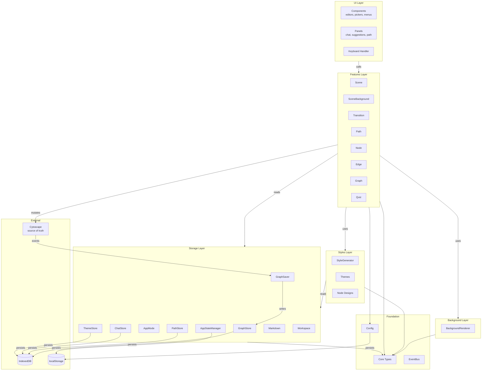

# Knogra Architecture

> **Status:** Current  
> **Last reviewed:** 2026-08-08  
> **Authority:** Main authoritative architecture document for layers, dependency direction, module responsibilities, persistence ownership, and coding standards. For detailed scene, fold, visibility, and transition terminology, defer to [Scene Transitions](scene-transitions.md). For typed edge styling and scene-local edge type visibility, defer to [Edge Types Architecture](edge-types-architecture.md).  
> **Related:** [Documentation map](README.md), [Workspace architecture](workspace-architecture.md), [Scene transitions](scene-transitions.md), [Edge Types Architecture](edge-types-architecture.md)

## Section 1. Core Philosophy

**Modular layered architecture with vertical feature organization.**

The app uses horizontal layers at the top level (UI, Features, Background, Styles, Storage) and vertical slices inside Features. Each feature coordinates with Cytoscape and stays independent of the others.

This keeps boundaries clear, preserves predictable data flow, and keeps modules easy to reason about.

**Primary scene persistence flow:**
```
UI → Features → Cytoscape → GraphSaver → Database
```

Cytoscape is the core component responsible for manipulation and presentation of scenes. The current/real-time state of the scene is tracked by Cytoscape (not by any other state management system). Cytoscape is the **source of truth** for graph state.

Some operations are not Cytoscape-derived scene mutations and therefore write through explicit storage services instead of GraphSaver: workspace save/open, custom themes, Markdown build/update/export, background image library updates, saved paths, chat notes, app mode, and cross-scene deletion cleanup. These exceptions must stay named and intentional.

**Dependency maps:** Dependency-cruiser reports live under `.ws/deps/outputs/`. The default architecture-orientation report is `.ws/deps/outputs/toprepo/toprepo-list.txt`, generated from `.ws/deps/toprepo.txt` with two-level expansion. The generator `.ws/deps/generate-deps.js` is configurable: use `+N`, `+X`, exclusions, and anchors to produce broader or narrower views of the whole codebase or a specific subsystem. When this architecture document changes in a way that affects layer boundaries, dependency direction, or module ownership, regenerate the relevant dependency map and compare it against this document.

---

## Section 2. Lexicon

### Graph vs Scene
**Graph** — The complete knowledge graph stored in the database. Contains all nodes and edges that exist, regardless of visibility.

**Scene** — A curated view/perspective on the graph. Defines:
- Which nodes and edges to display
- Where to position each node
- How to style each node (design, scale)
- Viewport settings (zoom, pan)
- Background images
- Fold state (which subtrees are collapsed)
- Edge type visibility state

**Key insight:** The same node can appear in multiple scenes with different positions and styles.

### Included vs Visible
A node's relationship to a scene has two distinct levels:

**Included** — The node is an element of the scene (stored in the scene's database record under `scene.nodes`). It exists in Cytoscape when the scene is loaded, but may be hidden.

**Visible** — The node is included AND not folded (hidden). It is rendered on screen and the user can see and interact with it.

This distinction matters for transition routing: a morph transition requires the target scene's central node to be **visible** (not merely included) in the current scene. A folded node has no visual presence to morph from, so the close+open path is used instead.

### Scene vs SceneBackground
**Scene** — Manages the **graph layer** (nodes, edges, positions, styles via Cytoscape)
**SceneBackground** — Manages the **canvas layer** (background images via BackgroundRenderer)

These are peer features with distinct responsibilities.

### Path
**Path** — A sequence of scenes produced by user navigation. It may exist in memory during a session or be persisted for later replay.

### Workspace
**Workspace** — Complete application state held in IndexedDB and localStorage: graph data, settings, chat history, saved paths, custom themes, shelf, and app state. A workspace is not a file; it is the live contents of browser storage.

### Interchange Artefacts
Two files carry data in and out of a workspace. They are unrelated formats with unrelated jobs, and no operation reads both.

**Workspace file** — A lossless snapshot of a workspace, saved and opened as a whole. Nothing is matched, merged, or interpreted. Canonical doc: [Workspace architecture](workspace-architecture.md).

**Knogra Markdown document** — A lossy, human- and AI-readable projection of a graph: an optional Mermaid diagram plus prose sections. Used to author a graph and to refresh its content. Carries no positions, scenes, designs or themes, and is never a backup. Canonical doc: [Markdown architecture](markdown-architecture.md).

### Shelf
**Shelf** — Collection of AI-suggested nodes waiting to be placed on the graph. Managed by NodeShelf, displayed by SuggestionPanel.

### Operation Verbs
To distinguish between graph operations and scene operations:

| Scope | Verbs | Examples |
|-------|-------|----------|
| **Graph** (database) | Add, Delete, Create, Update | `addNode()`, `deleteEdge()` |
| **Scene** (view) | Include, Exclude, Expand, Collapse, Show, Hide | `includeNode()`, `excludeEdge()` |
| **Fold** (visibility) | Fold, Unfold | `foldNode()`, `unfoldNode()` |
| **Interchange** (files) | Save, Open — workspace file | `exportWorkspace()`, `importWorkspace()` |
| **Interchange** (files) | Build, Update, Export — Markdown document | *Build* creates a graph from a document; *Update* applies a document's content to the open graph |

**Note:** Operations can be bundled — e.g., `addChild()` creates a node in the database AND includes it in the current scene.

---

## Section 3. Architecture Layers

### 3.1 Layer Overview



**Dependency direction:** UI → Features → Background/Styles/Storage → Core

### 3.2 Foundation Layers

#### Core (`src/core/`)
Type definitions and interfaces. **No logic.**

| File | Purpose |
|------|---------|
| `main-types.ts` | Primitive IDs, Node, Edge, Scene, Path, provider, and app mode types |
| `style-types.ts` | Theme, visual primitive, node style, edge style, and Cytoscape style types |
| `background-types.ts` | Background image and filter types |
| `design-types.ts` | Node/edge design system types |
| `chat-types.ts` | Chat persistence types |
| `quiz-types.ts` | Runtime quiz configuration, snapshot, and node-status contracts |

#### Config (`src/config/`)
Application settings and user preferences.

| File | Purpose |
|------|---------|
| `index.ts` | `getSetting()` facade |
| `storage-config.ts` | Database names, keys, schemas |
| `setting-definitions.ts` | All configurable settings with defaults |
| `transition-settings.ts` | Animation timing configurations |
| `ai-settings.ts` | AI provider settings |

**Storage:** Persisted to localStorage with `knogra.` prefix.

### 3.3 Storage Layer (`src/storage/`)

#### Graph Persistence

**GraphStore** (`graph-store.ts`)
- IndexedDB-backed cache of nodes, edges, edge types, scenes, and background images
- Read by Features, UI, Background, Styles, diagnostics, and storage workflows
- Written by GraphSaver for Cytoscape-derived scene persistence; explicit storage workflows handle seeding, workspace open, Markdown build and update, deletion cleanup, background image library changes, theme changes, and scene auto-creation

**GraphSaver** (`graph-saver.ts`)
- Listens to Cytoscape events and debounced-saves scene state to GraphStore
- Handles deletion queues and scoped `suspend(reason)` / `resume(token)` semantics so transitions, fold/unfold, collapse/expand, and View mode do not interfere with one another

#### Session State

**AppStateManager** (`app-state.ts`)
- Manages session state in localStorage (`knogra.state`)
- Tracks last opened scene, persisted app mode (`view` / `edit`), and one-shot startup fit requests
- Listens to EventBus `sceneChanged` events
- Static class with helpers for reading, writing, and clearing app state

**AppMode** (`app-mode.ts`)
- Runtime View/Edit mode state that persists through AppStateManager, suspends GraphSaver in View mode, and emits `appModeChanged`

#### Auxiliary Stores

**PathStore** (`path-store.ts`)
- Separate IndexedDB (`knogra-paths`) for saved navigation paths
- Independent cache and CRUD operations

**ChatStore** (`chat-store.ts`)
- Separate IndexedDB (`knogra-chat`) for AI conversations keyed by `nodeId`

**ThemeStore** (`theme-store.ts`)
- Separate persistence for custom themes merged into `styles/themes.ts`

**Markdown** (`storage/markdown.ts` + `storage/markdown/`)
- Owns the Knogra Markdown document and the three operations on it: **Build** (document → new graph, replacing the workspace), **Update** (document content → the open graph, structure untouched), and **Export** (open graph → document)
- `document/` parses and serializes the artefact — an optional Mermaid diagram plus the `Knogra …` content sections; `build/` slices the diagram into scenes and lays each out (radial, flow, or fan); `update/` resolves ids, plans, and applies
- Identity is by id only: `node.properties.externalId` and `ChatMessage.externalId` record what a document called an element, which is what makes Update possible. Update suspends GraphSaver and reloads rather than mirroring into live Cytoscape
- Build options cover configurable edge-type scene inclusion and branch/leaf tagging; the scene-composition and fan-continuity model lives in [mermaid-fan-layout.md](mermaid-fan-layout.md). Canonical doc: [Markdown architecture](markdown-architecture.md)

#### Workspace

**Workspace** (`workspace.ts`)
- Export/import complete workspace as `.knogra` ZIP file
- Delegates transfer, dialogs, and validation to `storage/workspace/`
- Collects graph, settings, chat, paths, backgrounds, custom themes, shelf, and app state

### 3.4 Background And Styles Layers

#### Background (`src/background/`)

**BackgroundRenderer** (`background-renderer.ts`)
- Canvas layer for scene background images
- Positioned behind Cytoscape (z-index: 0)
- Images positioned in graph coordinates
- Transforms with zoom/pan events
- Injected into features that need it (SceneBackground, Transition)

**Design rationale:** Background rendering stays separate from Cytoscape so it can be optimized independently.

#### Styles (`src/styles/`)

**StyleGenerator** (`style-generator.ts`)
- Pure stylesheet generation and stylesheet-update helpers for Cytoscape
- Owns node/edge style rule construction, edge type selector rules, visibility selector rules, and central/selected selector rules
- Applies styles through `cy.style().fromJson(stylesheet).update()`

**Edge visual resolver** (`edge-visual-resolver.ts`)
- Resolves declarative edge visual state from theme, edge type, edge type override, scene edge override, and scene-local edge type visibility
- Used by scene opening and transition paths so animations target resolved edge opacity rather than hardcoded visibility values

**Themes** (`themes.ts`, `theme-store.ts`)
- Built-in and custom color themes
- Scene theme is resolved by `scene.themeId`; there is no separate global current theme state

**Designs** (`styles/designs/`)
- Built-in node renderers and design registry that converts node data, scene design parameters, and theme into Cytoscape node styles

### 3.5 Features Layer (`src/features/`)

#### Feature Organization Patterns

**Small features** (single file):
```
node.ts         # All logic in one class
edge.ts
graph.ts
scene-background.ts
```

**Large features** (folder with utilities):
```
scene/
  scene.ts        # Main feature class
  traversal.ts    # Feature-owned pure utilities
  elements.ts     # Element management helpers
  viewport.ts     # Viewport calculations

transition/
    transition.ts            # Public transition facade and routing
    opening-closing/         # Open/close scene animation path
    scene-to-scene/          # Morph transition path
    scene-factory-utils.ts   # Scene auto-creation utilities
    fold-state-handler.ts    # Fold-state application after scene changes

path/
  path.ts         # Main feature class
  history.ts      # Navigation history logic
```

**Subclass extraction pattern:**
When a feature has many related methods sharing dependencies, extract them into a helper class (not pure functions). The helper class holds shared state such as `cy`, `container`, or `renderer`; the main feature class orchestrates.

Example: transition helpers in `transition/opening-closing/` and `transition/scene-to-scene/` hold shared dependencies and execute specific animation or classification steps while `Transition` routes public actions.

**Shared utilities** (`features/utils/`):
Used by 2+ features. Split by purity:

| Type | Location | Rules |
|------|----------|-------|
| Pure | `utils/pure/` | No side effects, no Cytoscape access |
| Cy-mutating | `utils/cy/` | Accept `cy` as parameter |

Example: `utils/cy/node-position-animator.ts` tweens a node set to new positions (optionally re-framing the viewport) and is shared by `autolayout` and `arrange` — neither imports the other, honouring the no-cross-feature-imports rule (§4.2).

**Dependency rules:**
```
Features (scene.ts, node.ts, etc.)
  ↓ can use
Shared Utils (utils/cy/, utils/pure/)
  ↓ can use
Core Types only

❌ Shared utils CANNOT import from features
❌ Pure utils CANNOT import cy utilities
```

#### Feature Catalog

| Feature | Location | Purpose |
|---------|----------|---------|
| **Scene** | `scene/scene.ts` | Graph layer: node/edge composition, positions, styles (via Cytoscape) |
| **SceneBackground** | `scene-background.ts` | Canvas layer: background images (via BackgroundRenderer) |
| **Node** | `node.ts` | Node design and content operations |
| **Edge** | `edge.ts` | Edge design and content operations |
| **Graph** | `graph.ts` | Graph construction: add/delete nodes and edges |
| **Transition** | `transition/transition.ts` | Animated scene-to-scene navigation |
| **Path** | `path/path.ts` | Navigation history tracking and persistence |
| **Quiz** | `quiz.ts` | Runtime recall mode: hides sampled node content and tracks reveal/self-grade state |
| **AutoLayout** | `autolayout/autolayout.ts` | Scene-wide re-arrangement anchored on the central node: radial layout (pluggable algorithms), grow & arrange, rotate, and apparent node size (enlarge/shrink) |
| **Arrange** | `arrange/arrange.ts` | Selection-scoped geometric tools anchored on the selection's own centroid: align, distribute, circle, grid (axis-aligned and diagonal), rotate, tighten/spread, plus a one-shot undo of the last arrangement. Pluggable tool registry — see [arrange-architecture.md](arrange-architecture.md) |

**FeatureAPI** (`feature-api.ts`) — Facade exposing all features. No business logic.

### 3.6 Events Layer (`src/events/`)

**EventBus** (`event-bus.ts`)
- Typed publish/subscribe for cross-module communication
- Enables cross-module notifications without direct module imports

**Cytoscape Custom Events:**

| Event | Payload | Emitted by | Consumed by |
|-------|---------|------------|-------------|
| `scene:changed` | `sceneId` | Transition | Path |
| `path:updated` | (none) | Path | PathPanel |

**Usage pattern:**
```typescript
// Emitting (transition.ts)
this.#cy.emit('scene:changed', [targetSceneId]);

// Subscribing (path.ts)
this.#cy.on('scene:changed', (_event, sceneId) => {
  this.#history.push(sceneId);
});
```

**EventBus events** (for non-Cytoscape communication):

| Event | Payload | Emitted by | Consumed by |
|-------|---------|------------|-------------|
| `sceneChanged` | `{sceneId, centralNodeId}` | Transition | ChatSession, NodeShelf, AppStateManager, diagnostics, FoldBadge |
| `transitionStart` | (none) | Transition | UI transition guards |
| `transitionEnd` | (none) | Transition | UI transition guards |
| `appModeChanged` | `{mode}` | AppMode | Quiz, SuggestionPanel, and other mode-aware UI |
| `pathModeChanged` | `{active, pathId, name}` | Path | Transition (navigation guard), Graph (deletion guard), PathPanel, ContextMenu, NodeManager |

### 3.7 AI Module (`src/ai/`)

AI-assisted learning companion. Provides contextual help, suggestions, and graph modifications.

**Structure:**
| File | Purpose |
|------|---------|
| `types.ts` | Message, Action, Conversation, ShelfItem types |
| `providers/provider.ts` | AI provider interface + factory |
| `providers/gemini-adapter.ts` | Gemini API implementation |
| `providers/openrouter-adapter.ts` | OpenRouter API implementation |
| `context-builder.ts` | Builds system prompt from graph state |
| `chat-session.ts` | Manages conversation state |
| `node-shelf.ts` | Suggestion state; orchestrates placement via FeatureAPI |
| `shelf-design-selector.ts` | Selects designs for shelf items |

**NodeShelf** is the AI→Features integration point. It:
- Manages suggested nodes per scene, converts AI actions to shelf items, and calls FeatureAPI when the user approves placement

**Storage:**
- ChatStore (`storage/chat-store.ts`) — Separate IndexedDB for conversations

**Integration:**
- **Reads:** `graphStore` (read-only access to graph data)
- **Writes:** `FeatureAPI` (all graph modifications go through features)
- **Subscribes:** `sceneChanged` event via EventBus

### 3.8 UI Layer (`src/ui/`)

UI owns DOM rendering, dialogs, menus, keyboard handling, and ergonomic interaction flows. Domain mutations should go through Features or explicit storage services. Some current UI modules still write directly to stores; those are named technical debt.

#### Components (`ui/components/`)

**UIComponentAPI** (`ui-component-api.ts`) — Facade for all components.

| Component | Purpose |
|-----------|---------|
| `node-editor/` | Edit node modal — tabbed shell plus one module per tab |
| `quick-title-editor.ts` | Anchored popover for quick node rename (`;` / `F2`) |
| `edge-editor.ts` | Edit edge modal |
| `edge-type-manager.ts` | Workspace edge type registry and type-level style editor |
| `edge-type-visibility-modal.ts` | Scene-local **Edges visibility** controls |
| `node-manager.ts` | Node management and scene cleanup dialog ⚠️ |
| `node-picker.ts` | Node selection dialog |
| `scene-picker.ts` | Scene selection dialog |
| `path-manager.ts` | Saved path manager — list, walk, edit, generate (parts in `path-manager/`) |
| `background-editor.ts` | Background image picker/editor ⚠️ |
| `theme-picker.ts` | Scene theme picker — selects a theme, inspects its parameters read-only |
| `theme-preview.ts` | Static theme sample rendered by the picker |
| `quiz-panel.ts` | Floating quiz controls for runtime recall mode |
| `settings-modal.ts` | Application settings |
| `connection-badge.ts` | Connection count badges |
| `fold-badge.ts` | Fold state affordance |
| `shortcut-overlay.ts` | Keyboard shortcut overlay |

⚠️ **Technical debt:** `background-editor.ts` and parts of `node-manager.ts` directly access storage. Prefer feature/service facades for future edits.

`path-manager.ts` persists through the Path feature (UI → Features → Storage) and is the
reference for how the remaining cases should be reworked.

#### Context Menu (`ui/context-menu/`)

Right-click menus for node, edge, and canvas — the app's primary command surface, organized as
its own subsystem rather than a single component.

| File | Purpose |
|------|---------|
| `context-menu.ts` | Public face: Cytoscape `cxttap`/`dbltap` wiring, menu lifecycle (close on click/escape/blur) |
| `menu-renderer.ts` | `MenuItem` type and generic DOM rendering: positioning, submenu hover, window activation on open |
| `menu-context.ts` | `MenuDependencies` bundle, `StyleClipboard` (copy/paste style state), shared items (mode toggle, Arrange submenu) |
| `node-menu.ts` / `edge-menu.ts` / `canvas-menu.ts` | Per-surface builders — pure functions `(deps, …) => MenuItem[]`, no DOM or event wiring |
| `editor-openers.ts` | Node/edge editor opening, shared by double-tap wiring and menu actions |

Menu content changes are localized: each right-click surface has exactly one builder file.

#### Panels (`ui/panels/`)

**PanelAPI** (`panel-api.ts`) — Facade for all panels.

| Panel | Purpose |
|-------|---------|
| `chat-panel/` | Chat, notes, tutorial timeline, AI controls ⚠️ |
| `suggestion-panel.ts` | AI-suggested nodes shelf |
| `path-panel.ts` | Navigation breadcrumbs (window arithmetic in `breadcrumb-window.ts`) |

⚠️ **Technical debt:** `chat-panel/chat-note-editor.ts` writes notes directly to ChatStore. This should eventually move behind a feature/service facade.

#### Keyboard Handler

**KeyboardHandler** (`keyboard-handler.ts`)
- Keyboard shortcuts → calls `features.*`

### 3.9 Utils (`src/utils/`)

Pure functions and external package wrappers shared across layers.

| File | Purpose |
|------|---------|
| `mathjax.ts` | MathJax initialization |

**Note:** Most utilities are feature-specific and live in `features/utils/`.

### 3.10 Restrictive Regimes (Cross-Layer)

Several parts of the app deliberately take capabilities away from the user. They grew up
independently but form one family, and a new restriction should join this table rather than
invent a fourth mechanism.

| Regime | Purpose | Restricts | Owner | Layer | Lifetime |
|--------|---------|-----------|-------|-------|----------|
| **View mode** | Protect the graph from accidental edits; reading and presentation | *All* graph mutations; GraphSaver suspended | `storage/app-mode.ts` | Storage | Persisted, long-lived |
| **Quiz mode** | Test recall | Hides sampled node content; forces View mode | `features/quiz.ts` | Features | Session |
| **Transition input guard** | Prevent input from corrupting state mid-animation | *All* input, for the duration of one animation | `ui/transition-input-guard.ts` | UI | ~1 second |
| **Shelf interaction guard** | Prevent commands from disrupting an in-flight AI-shelf animation | *All* input during Add/Remove-from-shelf execution (full block); shelf commands only during post-transition / AI-addition re-arrangement (shelf-only block) | `ui/shelf-interaction-guard.ts` | UI | ~sub-second (one shelf animation) |
| **Path mode** | Linear guided traversal of a fixed scene sequence | Graph-initiated scene navigation; node/edge/scene **deletion** | `features/path/path.ts` | Features | Session, persisted in `knogra.state` |

**Why they compose without negotiation:** each regime restricts for a *different reason*, and
where two regimes touch the same capability the narrower one is a strict subset of the wider one.
Quiz stacks on View by design. Path mode stacks on either. No regime needs to know another exists.

**Rule — one owner per rationale, subsets permitted.** A new restriction must not duplicate an
existing regime's *purpose*; two regimes protecting the same thing for the same reason is a defect
and they must be merged. A regime may restrict a capability another regime also restricts, provided
it is a **narrower subset held for a distinct reason** — and that reason must be recorded in this
table.

*Worked example:* View mode blocks all graph mutation to protect the graph from accidental edits.
Path mode blocks only deletion, to protect the integrity of the sequence being walked — a walked
path must not have scenes removed from under it. Creation, editing, scene composition, fold, and
layout stay live in path mode. Different reason, strict subset, no conflict.

**Why the shelf guard is separate from the transition guard.** Both are UI input-plumbing that
protect an animation, so at a glance they look mergeable — but they guard *different* animations
with *different* scope. The transition guard is single-level and globally blocks input for one
scene transition. The shelf guard is two-level: a **full block** during scene-mutating
Add/Remove-from-shelf commands, plus a lighter **shelf-only block** that refuses shelf commands
while leaving the rest of the app interactive during post-transition and AI-addition
re-arrangements. That shelf-only level has no analogue in the transition guard, and keeping the two
independent leaves the delicate, well-tested transition path untouched. Distinct subject and reason,
per the rule above — sibling regimes, not a duplicate.

**Layer placement rule:**

| Kind of mode | Layer | Mechanism |
|--------------|-------|-----------|
| Persisted, user-facing application mode | Storage | Module-level singleton + EventBus broadcast (`app-mode.ts`) |
| Transient mode owned by one feature | Features | Feature-private state + EventBus broadcast (`quiz.ts`) |
| Pure input plumbing with no domain meaning | UI | EventBus subscription + DOM capture (`transition-input-guard.ts`); or direct panel wiring + DOM capture (`shelf-interaction-guard.ts`) |

**Enforcement rule:** the consequence of a mode belongs to the *owner* of the mode, expressed
through EventBus, never through a cross-feature import (§4.2). A feature that must refuse an
action while another feature's mode is active subscribes to that mode's event and guards its
own entry point. Guarding at scattered UI call sites is permitted only for *affordances*
(greying out menu items, disabling buttons) — never as the sole enforcement, because
affordances drift as entry points are added.

---

## Section 4. Dependency Rules & Constraints

### 4.1 Layer Dependency Direction

```
UI Layer
    ↓ calls
Features Layer
    ↓ uses
Background / Styles / Storage
    ↓
Core
```

### 4.2 Architectural Constraints

| Layer | Constraint |
|-------|------------|
| **UI** | May use Cytoscape for ephemeral interaction state such as selection, rendered positions, temporary input blocking, and overlay positioning. Domain mutations should go through Features or explicit storage services. |
| **UI** | Domain mutations should go through Features or explicit storage services; direct store writes are technical debt unless the UI component is itself the storage workflow surface |
| **Features** | Cytoscape-derived scene mutations should flow through Cytoscape and GraphSaver |
| **Features** | Direct GraphStore writes are allowed only for named non-Cytoscape operations: scene auto-creation, theme/background persistence, graph deletion cleanup, workspace open and Markdown build/update, seeding, and diagnostics/validation workflows |
| **Features** | Independent of each other (no cross-feature imports) |
| **Features** | Config is read-only (use `getSetting()`) |
| **Background** | Canvas rendering only; scene membership and graph mutations stay outside the renderer |
| **Styles** | Style generation only; business decisions stay in Features/UI |
| **Storage** | Stores own persistence mechanics and import/export workflows; GraphSaver owns autosave from Cytoscape events |
| **Shared Utils** | Cannot import from feature files |

### 4.3 Critical Contracts

#### Cytoscape Scratch Space
Used for coordination between layers:

```typescript
cy.scratch('currentSceneId', sceneId)  // Track active scene
cy.scratch('activeNodeId', nodeId)     // Track selected node
cy.scratch('nodesToDelete', [ids])     // Queue for deletion
cy.scratch('edgesToDelete', [ids])     // Queue for deletion
cy.scratch('foldedNodes', state)       // Runtime fold state for current scene
```

#### Scene Ownership
- Scene determines **which** nodes/edges are visible
- Scene determines **where** each node is positioned
- Scene determines **how** each node is styled
- Same node can exist in multiple scenes with different positions/styles

#### Delete vs Exclude

| Operation | Method | Effect |
|-----------|--------|--------|
| **Delete** | `graph.deleteNode()` | Removes from database permanently. Node disappears from ALL scenes. |
| **Exclude** | `scene.excludeNode()` | Removes from current scene only. Node still exists, can be included elsewhere. |

#### Persistence Ownership
- Cytoscape-derived scene changes are persisted by GraphSaver.
- GraphSaver reads Cytoscape elements, viewport, `currentSceneId`, deletion queues, and `foldedNodes` scratch state.
- Explicit storage workflows may write stores directly when the state does not originate from Cytoscape events.
- Direct writes must be local, named, and documented by the owning module.

---

## Section 5. Data Flow

### 5.1 Write Path: Cytoscape-Derived Scene Mutations

```
User Action
    ↓
UI Component (context menu, editor, keyboard)
    ↓
Feature Method (features.scene.includeNode, features.node.update, etc.)
    ↓
Cytoscape Mutation (cy.add, node.data(), node.remove, etc.)
    ↓
Cytoscape Event (add, remove, data, free, viewport)
    ↓
GraphSaver Listener
    ↓
Debounced Save (500ms)
    ↓
Extract State from Cytoscape
    ↓
GraphStore Write (updateScene, updateNode, deleteNode, etc.)
    ↓
IndexedDB Persistence
```

### 5.1b Write Path: Explicit Storage Workflows

```
User Action or startup/import flow
    ↓
Owning UI / Feature / Storage service
    ↓
Explicit store method or workspace transfer helper
    ↓
IndexedDB / localStorage persistence
```

Examples: workspace save/open, Markdown build/update/export, custom themes, saved paths, chat notes, background image library, app mode, seed workspace, and cross-scene deletion cleanup.

### 5.2 Read Path (Queries)

```
UI or Feature needs data
    ↓
Read from GraphStore cache (graphStore.nodes, graphStore.scenes, etc.)
    ↓
Return immediately (in-memory, fast)
```

**Note:** Cache is populated on app init and updated by GraphSaver or explicit storage workflows. UI/Features should prefer feature/service facades for writes; existing direct writes are named debt or explicit workflow surfaces.

### 5.3 Event Flow

```
Scene transition occurs
    ↓
Transition emits cy.emit('scene:changed', [sceneId])
    ↓
    ├── Path.#history.push(sceneId) + cy.emit('path:updated')
    ├── AppStateManager.saveLastSceneId(sceneId)
    └── eventBus.emit('sceneChanged', {sceneId, centralNodeId})
            ↓
            ChatSession / NodeShelf / diagnostics / UI listeners react
```

### 5.4 Workspace Export/Import Flow

**Export:**
```
User triggers export
    ↓
Workspace.exportWorkspace()
    ↓
Collect from all sources:
    - GraphStore (nodes, edges, scenes, backgroundImages)
    - localStorage (settings, shelf, app-state)
    - ChatStore (conversations)
    - PathStore (saved paths)
    - ThemeStore (custom themes)
    ↓
Create ZIP with manifest
    ↓
Trigger browser download (.knogra file)
```

**Import:**
```
User selects .knogra file
    ↓
Workspace.importWorkspace(file)
    ↓
Validate manifest
    ↓
Clear all existing data
    ↓
Restore each store from ZIP
    ↓
Reload page to reinitialize app
```

---

## Section 6. Design Decisions

### Why Cytoscape is Source of Truth
- Visual library owns the rendering state
- Events naturally trigger on user interactions
- Single clear mutation point
- No sync conflicts between multiple state stores

### Why GraphSaver is Separate from Features
- Features focus on business logic
- GraphSaver is pure infrastructure (auto-save)
- It can be scoped-suspended during transitions, fold/unfold, collapse/expand, and View mode

### Why Direct Storage Workflows Exist
- Not all persisted state originates from Cytoscape events
- Workspace save/open, Markdown interchange, paths, chat notes, themes, background image library, and app mode have their own storage contracts
- Keeping those as explicit workflows is clearer than forcing unrelated data through Cytoscape
- The tradeoff is stricter discipline: direct writes must be named, local, and reviewed as architecture exceptions

### Why Scenes Store Positions
- Enables multiple perspectives on same graph
- Example: Node "Central Dogma" might be:
  - Large and centered in "Molecular Biology" scene
  - Small and peripheral in "History of Science" scene
- Positions are part of the "view", not the "data"

### Why In-Memory Cache in GraphStore
- Fast reads for UI rendering
- Database reads are async and slow
- Cache updated by GraphSaver after each write
- Trade-off: memory vs speed (acceptable for <10k nodes)

### Why Separate Background And Styles Layers
- Cytoscape handles graph elements; canvas handles backgrounds
- StyleGenerator handles Cytoscape stylesheet construction
- Separation allows independent optimization and cleaner injection into features that need it

### Why Subclass Extraction Pattern
- Large features benefit from extracting method groups into helper classes
- Maintains OOP encapsulation (shared `cy`, `container` references)
- Reduces main file size while keeping related code together
- Alternative to pure function extraction when methods share state

---

## Section 7. Coding Standards

### 7.1 Naming Conventions
- Use shared lexicon (Graph vs Scene, Add vs Include, etc.)
- Use specific descriptive names
- Avoid generic, ambiguous, or overloaded terms
- Strive for short names; avoid redundant components

### 7.2 File Size Limits
- Target: ~300 lines maximum per file
- When exceeded, extract to:
  - Pure utilities (stateless functions)
  - Feature-owned utilities (same folder)
  - Subclasses (for OOP extraction with shared state)

### 7.3 Nesting Limits
- Maximum 2 levels of nesting
- Use early returns to reduce nesting
- Avoid multi-level conditions and loops

### 7.4 Feature Organization
- **Single file:** When feature is simple (<300 lines)
- **Folder:** When feature needs utilities or grows complex
- **Pure extraction:** For stateless helper functions
- **Subclass extraction:** For method groups sharing dependencies
