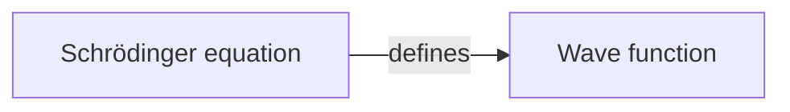

# Markdown Document Architecture

> **Status:** Implemented.  
> **Authority:** Canonical source for the Knogra Markdown document and the three operations on it —
> Build, Update, and Export. Supersedes the Mermaid import/export material in
> [architecture.md](architecture.md) §3.3.  
> **Out of scope:** The workspace file — an unrelated format with an unrelated purpose, see
> [Workspace architecture](workspace-architecture.md).  
> **Last updated:** 2026-08-13  
> **Related:** [Documentation map](README.md), [Architecture](architecture.md),
> [Workspace architecture](workspace-architecture.md),
> [Mermaid Fan Layout](mermaid-fan-layout.md) (layout model — unchanged by this work)
>
> Section numbers are cited from code comments. Renumber only with a matching sweep.

---

## 1. Purpose

The diagram stabilises early; the prose keeps changing. Re-importing a file to refresh its prose
destroys every scene, layout and design decision — the work that took longest.

The answer: one composable artefact, identity by id, and a second operation that updates an existing
graph's content without touching its structure or design.

---

## 2. Terminology

| Term | Definition |
|------|------------|
| **Knogra Markdown document** | A `.md` file carrying an optional Mermaid diagram plus optional `Knogra …` prose sections |
| **Content section** | One `Knogra …` heading and its entries |
| **Build** | Convert a document into a **new** graph. Replaces the workspace |
| **Update** | Apply a document's content to the **open** graph. Structure never changes |
| **Export** | Project the open graph into a document |
| **`externalId`** | The id an element is known by in external documents (§6) |
| **Message** | One `ChatMessage` record in ChatStore, attached to a node |
| **Note** / **Article** / **AI chat** | The three kinds of message (§2.2) |

- **Not "merge".** Nothing is reconciled between equals: one side is authoritative content, the
  other is a graph receiving it.
- **"Export" here always means export as Markdown.** Writing a workspace to a file is *Save*.
- **Spec names and menu labels differ.** This document says *Build*; the menu says
  `Workspace ▸ Markdown ▸ Import…`, which is the word users already know for "make a graph out of
  this file" and is disambiguated by nesting.

### 2.1 A Markdown document is never a backup

It carries no positions, scenes, designs, themes, viewports, folds or paths. The backup is the
workspace file, and this must be visible in the UI, not only here.

| Data | Workspace file | Markdown document |
|---|---|---|
| Nodes (title, tags, properties) | ✔ | ✔ |
| Edges + edge types | ✔ | ✔ (type name as label) |
| Notes (`source: 'note'`) | ✔ verbatim | ✔ round-trips |
| Articles (`source: 'tutorial'`) | ✔ verbatim | ✔ round-trips |
| AI chat | ✔ verbatim | ✔ export-only, ignored on read |
| Note image bytes | ✔ | link only |
| Scenes, positions, designs, folds | ✔ | ✘ |
| Themes, background images | ✔ | ✘ |
| Paths, shelf, settings, app state | ✔ | ✘ |

The workspace file restores every message exactly, because it is a dump of ChatStore. Markdown is
the **only** artefact that partitions messages by `source`, resolves them by id, and writes back a
subset.

### 2.2 Messages: one record, three kinds

Everything a node holds in ChatStore is a **message** — one `ChatMessage` shape, one store, one
ordered list per node. The `source` field is the only thing that distinguishes the kinds, and it is
what every rule in this document is phrased against.

| Kind | `source` | `role` | In the app | Build | Update | Export |
|---|---|---|---|---|---|---|
| **Note** | `note` | `user` | Editable, deletable, plain text, dated | ✔ | ✔ | ✔ |
| **Article** | `tutorial` | `assistant` | Locked — not editable, not deletable — markdown-rendered | ✔ | ✔ | ✔ |
| **AI chat** | `ai` (+ legacy, absent) | either | The conversation with the assistant | ✘ | ✘ | ✔ only |

**Articles are the reason this design exists.** They are prose written outside the app — by a graph
designer, or with an AI — that has to be brought in and then refreshed as it changes. Notes are
mostly born and edited inside the app; they round-trip because they can, not because that is the
workflow. Every rule below applies to both kinds identically unless it names one.

**`tutorial` is the stored value for articles**, kept for legacy data. The heading users read and
write is `Knogra articles`; renaming the stored value would migrate existing records to buy a nicer
internal spelling.

**Rendering follows `role`, permissions follow `source`.** Two fields deciding related things is a
trap — see §3.

---

## 3. Facts the design rests on

Properties of the surrounding code that the rules below depend on. Each is cited where it bites.

**The message model** — the obvious assumption is wrong:

| What | `role` | `source` |
|---|---|---|
| Question to the AI | `user` | `ai` |
| AI reply | `assistant` | `ai` |
| Note typed in the note editor | **`user`** | `note` |
| Article | `assistant` | `tutorial` |
| Legacy | either | *absent* |

`source` selects the renderer, varies the context menu, and decides what **Clear messages** can
remove — it offers *AI* (`ai` + legacy) and *Notes* (`note`), so `tutorial` cannot be bulk-removed
at all. **Any rule phrased in terms of `role` selects the wrong set:** notes are `role: 'user'`.

**Two write hazards.** GraphSaver's `#saveContent()` re-extracts `title`, `tags` and `properties`
from live `cy` every sync, so a store-only write is silently reverted for every node in the open
scene (§5.7). And the node editor rebuilds the property bag on save: `advanced-tab.ts` strips keys
from the displayed JSON, so a key hidden but owned by no tab is deleted on every save (§6.3).

---

## 4. The document

### 4.1 Composability

Every part is optional, including the diagram: a **Mermaid flowchart**, plus the **equations**,
**tags**, **comments**, **notes**, **articles** and **ai chat** sections in any combination. That is
what gives the document its three uses — authoring a graph, refreshing its prose, and reading or
discussing it outside the app.

### 4.2 Shape

````markdown
# Knogra Graph — Quantum Mechanics



## Knogra equations

n-1754-901-234-567: `i\hbar\frac{\partial}{\partial t}\Psi = \hat{H}\Psi`

## Knogra tags

n-1754-901-234-567: physics, core, equation

## Knogra comments

n-1754-901-234-567: Needs a worked example for the time-independent case.
</note>

## Knogra articles

n-1754-901-234-567:intro:
## The equation of motion

The role Newton's second law plays classically. Markdown is rendered.
</note>

## Knogra notes

n-1754-901-234-568:msg-1754901234-ab7f3c2:
A note written in the app. Plain text, editable, deletable.
</note>

## Knogra ai chat

n-1754-901-234-567:msg-1754901234-cd9e1f4:user:
Why does the wave function collapse on measurement?
</note>

n-1754-901-234-567:msg-1754901234-ef5a8b1:assistant:
Collapse is a postulate rather than a derived result…
</note>
````

One blank line after each heading, none between entries.

### 4.3 Grammar

- **Equations and tags** are one line: `<nodeId>: value`. Equations are backtick-wrapped, tags are
  comma-separated. An empty value is skipped.
- **Comments** are single-valued prose keyed by node id alone: `<nodeId>: body` closed by `</note>`.
  The note-id rule below deliberately does not apply.
- **Prose** (`notes`, `articles`): `<nodeId>:<noteId>:` followed by the body — inline on the same
  line or starting on the next — closed by `</note>`. The note id is recognised **only** when the
  text between the first and second colon matches `[A-Za-z0-9_-]+` with no surrounding whitespace.
  Anything else means the entry carries no note id and everything after the first colon is body. So
  `N1:intro: text` names note `intro`, while `N1: Note: this matters` is an id-less entry.

  **The space is the discriminator, and that is what keeps old documents readable** (§9): every
  pre-existing document is written `<id>: body`, so the candidate never passes the token test and
  the body survives whole, colons and all. The one shape that misreads is `N1:Note: …` — no space
  *and* a body opening with a bare word and a colon. Build accepts either form; Update requires a
  note id (§6.2).
- **AI chat:** `<nodeId>:<messageId>:<role>:` + body + `</note>`, `<role>` = `user` | `assistant`.
  Three parts because a chat log without its questions is half a conversation. **Export-only and
  discarded on read.** Always the last section.
- **Duplicate keys:** last wins, across both prose sections as one keyspace — they land in one
  message list per node and are resolved by id without regard to kind. An article beats a note on
  the same key. Id-less entries are never deduped; without a key nothing says two are the same.
- All id parts match `[A-Za-z0-9_-]+`; Knogra `NodeId`s and `MessageId`s already satisfy it.
- **A section runs to the next Knogra heading or EOF**, so note bodies may contain `#` headings. An
  entry left open at section end is closed leniently.
- **Heading level is free** on read; export writes `##` under a `#` document title.
- **Every Knogra heading must be registered** in the single alternation in `sections.ts` — all six.
  That regex is both the section terminator and the diagram-body scrubber, so an unregistered
  heading is swallowed by the preceding section and leaks into the diagram.
- **No `flowchart` / `graph` header is required.** A document with no diagram parses to zero nodes
  and edges plus whatever content it carries — the normal input to Update.
- **No document version marker.** A hand-written document would never carry one, so no code may
  branch on its absence — which is the only thing a version marker is for.

### 4.4 One section per kind of prose

The kinds are in §2.2. **The heading carries the kind**, which is why the entry grammar needs no
`source` field. `Knogra tutorial` is the legacy spelling of `Knogra articles` — still read, never
written.

**Rendering follows `role`, permissions follow `source`** ([`chat-message-renderer.ts`](../src/ui/panels/chat-panel/chat-message-renderer.ts)):
markdown is rendered when `role === 'assistant'`, while editability and deletability are decided by
`source`. An article must therefore be written with `role: 'assistant'` and a note with
`role: 'user'`. Changing only the source once turned every imported article into literal
`## Heading` text.

**Articles are not sent to the AI.** [`chat-session.ts`](../src/ai/chat-session.ts) passes only
`ai` and legacy messages — an article can be long, and every request would carry it.

---

## 5. Operations

| | **Build** | **Update** |
|---|---|---|
| Result | Creates a new graph, replacing the workspace | Changes content in the graph already open |
| Diagram | Read — builds nodes, edges, scenes, layout | **Ignored entirely** |
| Content sections | Written onto the newly created nodes | Written onto existing nodes, matched by id |
| Structure | Created from the diagram | **Never changed** — no node or edge added or removed |
| Identity requirement | None — ids are recorded as `externalId` | Every entry must resolve by id (§6) |
| Configuration | Anchor, depth, layout, scene generation, edge-label mapping, which sections to apply | Which sections to apply |

Running the same document as a Build is always available; the two differ in what they may touch,
not in what they read.

### 5.1 Build

Unchanged in substance from today's Mermaid import, with four changes:

1. **Stamps `properties.externalId`** on every node, from the document's own node id (§6.3).
2. **Stamps `ChatMessage.externalId`** on every message it creates, from the document's note id
   where the entry carries one (§4.3). Without this the most natural workflow — author a document,
   Build from it, keep editing the same file — fails on its first Update: no note id would resolve,
   so every entry would be added a second time instead of replacing what Build wrote.
3. **`Knogra notes` produces `source: 'note'`** and `Knogra articles` produces `source: 'tutorial'`
   (§4.4). Previously both prose sections collapsed to `'tutorial'`, which left the round-trippable
   section empty on every newly built graph (§5.8).
4. **The diagram is optional at parse time** (§4.3), but **Build refuses a document without one**
   and names Update as the operation that reads content-only documents. Building nothing from
   nothing is not a useful case, and the right operation already exists.

Layout, scene slicing, edge mapping and the options dialog are untouched;
[mermaid-fan-layout.md](mermaid-fan-layout.md) is unaffected.

The confirm dialog states what `clearAllData()` actually destroys — not just the graph, but chat,
paths, background images and the shelf: *"This replaces everything currently in this browser —
graph, scenes, chat, images, paths and themes."*

### 5.2 Update — scope

**Content only.** No node or edge is created, removed, or re-linked; an entry naming no known node
is reported, not created (§6.1). That is what keeps Update free of every placement, layout and
scene-membership question. When a document carries both a diagram and content sections, **Update
ignores the diagram entirely.**

### 5.3 Update — node fields

| Section | Document has a value | No entry | Empty value |
|---|---|---|---|
| Equation | Replace | Leave untouched | Skip |
| Comment | Replace | Leave untouched | Skip |
| Tags | **Replace the whole set** | Leave untouched | Skip |

- **Empty means skip, never clear** — a stray blank line must not wipe a comment. Clearing is done
  in the app.
- **Tags replace, not combine.** Two accepted consequences: computed `leaf` / `branch` tags from
  Build are lost unless the document carries them, and since tags drive style copying, replacing
  them can change appearance. Tags are the one section with visual effect, so the preview says so.
- **Design is never touched.** Build sets `design = equationDesignId` for nodes with equations;
  Update must not — that is precisely the work being protected.

### 5.4 Update — prose messages (notes and articles)

Unlike equations, comments and tags, which are one per node, a node holds many messages — so each
entry must say *which* message it is. **The note id decides add-vs-replace**, and nothing else does.
Resolution is in §6.2. Per entry:

| Case | Result |
|---|---|
| Node resolves, note id resolves | **Replace** that message's content |
| Node resolves, note id does not | **Add** a message, storing the entry's note id as its `externalId` |
| Node resolves, entry has **no** note id | **Skip**, report — unclassifiable, never guessed at |
| Node does not resolve | **Skip**, report |

That is what makes Update idempotent: the second run finds the message the first run stamped, so
re-applying a document replaces content instead of accumulating copies. It needs no setting and no
bulk safeguard — the id is the whole mechanism.

| Question | Rule |
|---|---|
| Does a replaced message keep its `source`? | **Yes** — an article stays an article, a note stays a note |
| What `source` does an *added* message get? | The section's kind: `Knogra articles` → `tutorial`, `Knogra notes` → `note` (§4.4) |
| Do a replaced message's images survive? | **Yes** — replacing prose must not silently drop attachments |
| Where does an added message land? | Appended after existing history; all messages share one ordered list |
| Is a message deleted when the document omits it? | **Never** |

### 5.5 Update — settings

Presented in the dialog (§5.6), not persisted as global preferences:

| Setting | Default |
|---|---|
| Sections to apply (equations / comments / tags / notes / articles) | all on |
| Save workspace to file first | **on** |

**Save-first is not decoration.** Update replaces tag sets, overwrites equations and comments, and
replaces note bodies, and there is no undo. The preview shows what *will* happen but offers no
recovery after Apply — save-first is the only reason whole-plan approval is safe.

**Refused in View mode.** Update is an in-place graph content mutation, which is what View mode
exists to prevent ([architecture.md](architecture.md) §3.10). Opening a workspace file stays
available there because it *replaces* the workspace rather than editing it — different act,
different reason. Per §3.10 the refusal lives at the operation's entry point; greying the menu item
is an affordance, never the enforcement.

### 5.6 Update — one dialog

**Settings and preview are the same screen.** Choosing sections first and seeing the consequences
second asks the user to decide blind, which matters most for the one section that can change
appearance. Affordable because planning is pure: the document is parsed once and the graph read once
when the dialog opens, and nothing is written until Apply.

```
Update graph from document

Matched 47 of 52 nodes — 43 by node id, 4 by external id

  [x] Equations   12 replaced       [x] Tags       18 replaced  ← may change appearance
  [x] Comments    31 replaced       [x] Articles   38 replaced, 3 added
                                    [x] Notes       4 replaced, 1 added, 9 unchanged

Not matched (nothing will change)
  5 document entries name no known node · n-1754-901-234-570 · n-1754-901-234-571 · …
  2 prose entries carry no note id

  [x] Save workspace to file first        [ Cancel ]  [ Apply ]
```

**Whole-plan approval — one Apply, one Cancel.** Per-row selection is a lot of UI for a rare need,
and the escape hatch exists already: cancel, fix the document, re-run. A section with nothing to do
is disabled. **Unchanged entries are counted separately** so that re-applying a large document after
editing one entry reports the edit rather than the whole file.

### 5.7 Update — write path

The applier writes through `graphStore.updateNode` and `chatStore.saveConversation`, then reloads —
the same strategy the existing importers use, and the only one GraphSaver cannot clobber. Live-`cy`
mirroring without a reload is a possible later refinement, out of scope.

Two rules make it hold:

- **Suspend GraphSaver before writing, and never resume.** "Write then reload" alone is not enough:
  saves are debounced by 500 ms, so a save queued before the applier ran can fire between the store
  write and the navigation and overwrite every node in the open scene from stale Cytoscape data.
  `graphSaver.suspend(reason)` clears the pending timeout as well as blocking new ones.
- **Preserve app state.** Build calls `clearAppState()`, `saveLastSceneId()` and
  `requestFitOnNextOpen()` because it creates a new graph with a new anchor. Update must do **none**
  of them — the user must land back on the same scene, in the same mode, with the path session
  intact. The easiest thing to get wrong by copying the neighbouring function.

### 5.8 Export

- **Node ids: the real `NodeId`**, used directly as the diagram node id. Knogra ids already fit the
  identifier grammar, so every exported document is self-identifying and exactly matchable.
- **Note ids: the real `MessageId`**, written as `<nodeId>:<noteId>:` with the body on the following
  lines. Both ids sit on one line, so the file greps by either.
- **Messages are partitioned by `source`, never by `role`** (§3):

  | Section | Selects | Behaviour |
  |---|---|---|
  | `Knogra articles` | `source === 'tutorial'` | Round-trips — read back by Update |
  | `Knogra notes` | `source === 'note'` | Round-trips — read back by Update |
  | `Knogra ai chat` | `'ai'` or absent | Both roles, chronological. Export-only; ignored on read |

  Keeping ai chat export-only is what removes the main round-trip instability: re-reading an
  exported document cannot duplicate a conversation the app is still appending to.
- **Which parts are written is a per-export choice** — a checkbox each, all on except **ai chat**,
  which can dwarf the rest of the file. The **diagram** is a checkbox too: a document of only
  equations or only prose is a legitimate artefact, and on a large graph the flowchart is bulk the
  reader may not want. Such a file cannot build a graph — Update still reads it, because node ids
  come from the section entries, not from the diagram.
- **No `source` and no timestamps** are written; the workspace file holds them verbatim.
- **Images:** a markdown link where `sourceUrl` exists, appended to the entry body. Uploaded images
  have no URL to link, so they are omitted and their count is stated before export — a base64 data
  URL is unreadable to humans and models alike, and bytes belong in the workspace file.
- **File name and title** follow the workspace save: `graph-<anchor-slug>-<date>.md`, titled with
  the anchor node. Two graphs exported on one day must not collide.

---

## 6. Identity

Each document entry names something in the graph, and the app must decide which node — and for
notes, which note — it refers to. That decision is made **only by id**. Identity governs **Update**;
Build needs none, since it creates everything it names.

### 6.1 Naming a node

The `<id>` in every section is checked in this order:

1. **Real `NodeId`** — present when the document was exported by Knogra, or typed correctly by hand.
2. **`node.properties.externalId`** — the id the node carried in the document it was built from.

No match → **reported and skipped**. Nothing is created, nothing is guessed.

**Titles are never used, anywhere.** Title matching fails silently — a rename on either side breaks
the link with no error, and duplicate titles are possible since uniqueness is only warned. An
operation that quietly writes prose onto the wrong node is worse than one that refuses.

### 6.2 Naming a message

Applies identically to notes and articles. A node holds many messages, so naming the node is not
enough. The key is `<nodeId>:<noteId>:`.

`<noteId>` resolves **within the named node only**, against the real `MessageId` first, then
`message.externalId` (an author-chosen label). `intro` under node A and under node B are different
messages. Outcomes are tabulated in §5.4.

It is **mandatory for Update** — optional would make `n-123: Note: this matters` parse `Note` as a
note id, and an entry that cannot be classified must not be guessed at.

Where the ids come from, so that every route into the graph can later be updated:

| Route | Note id |
|---|---|
| **Export** | The real `MessageId`, so an exported document always updates cleanly |
| **Build** | Generates a `MessageId` and records the document's note id as `externalId` where the entry carries one (§5.1) |
| **Hand-authored** | Whatever the author writes — `intro`, `overview` — unique within its node |

**Build accepts id-less entries**; only Update requires the id.

### 6.3 `externalId`

- **Nodes:** `node.properties.externalId: string`, written at Build from the source document's node
  id. Shown read-only in the node editor's Identity tab, so a user can see what a document entry
  refers to.
- **Messages:** `ChatMessage.externalId?: string`, written by **Build** from the document's note id
  and by **Update** when it adds a message. This is what makes re-running a document idempotent.
- Not named `mermaidId`: the format is no longer Mermaid-specific.
- **The system-property list lives in `config/`** (`node-properties.ts`) — a declared table of the
  same kind as the storage keys and setting definitions beside it, not `core/`, which holds types
  and no data.
- **Hidden from the node editor's advanced tab *and* carried through on save.** Hiding alone is not
  sufficient (§3): a property hidden but owned by no tab is **deleted on every save**, so opening
  the editor and pressing Save would silently break matching. The tab that hides them restores them
  — stripped for display, re-attached on read *after* the user's JSON, so typing the key cannot
  overwrite one. `equation` and `comment` are restored by `#composeProperties` instead, because a
  *different* tab owns them. The principle either way: **whoever hides a key is responsible for
  carrying it through.**

### 6.4 Bootstrap: export first

A graph built before `externalId` existed matches nothing when an old source file is pointed at it.
Accepted, not worked around:

1. Export the graph as a Markdown document — written with real `NodeId`s and `MessageId`s.
2. Move the prose into it, or edit it in place.
3. Run it as an Update. From then on it round-trips indefinitely.

One editing step remains for documents written before the notes/articles split: prose meant to stay
locked and richly rendered sat under `Knogra notes`, which now means editable plain text. Move it to
`Knogra articles`, once per file.

No title-matching repair command is provided — reintroducing the mechanism for a bootstrap would
reintroduce it as a habit.

### 6.5 No bulk safeguard

An earlier design refused a prose section outright when no note id resolved. It was removed: the
first time authored articles are applied to a graph, **every** entry is legitimately new, so the
rule blocked the primary workflow. Wrong-workspace is answered one level up, by whether the
**nodes** resolve (§6.1), which the preview reports.

---

## 7. Constraints and no-goals

**Constraints**

1. No new dependencies. Browser-only.
2. **The GraphSaver rule** (§3): any in-place mutation of node content either mirrors into live
   `cy`, or suspends GraphSaver and then reloads. A reload alone is not enough (§5.7).
3. Validation stays informational, never a hard block.
4. Old documents keep working for Build. They cannot be used for Update — see §6.4.

**No-goals**

- Update never changes structure — no node or edge created or removed.
- No deletion semantics; absence of an entry never removes anything.
- No title matching, anywhere.
- No round-trip fidelity beyond the two prose sections (§4.4).
- No combining of two workspaces. No incremental or continuous sync.
- No per-row cherry-picking in the preview.
- Edges have no identity: edge titles, tags and types are not updatable from a document.

---

## 8. Module architecture

### 8.1 Layout

```
src/storage/markdown.ts          ← orchestration: Build, Update, Export. Beside the folder
src/storage/markdown/
├── document/
│   ├── sections.ts        parse + serialize the `Knogra …` sections       [pure]
│   ├── diagram.ts         parse + serialize the Mermaid flowchart         [pure]
│   ├── document.ts        whole-document facade; owns the model type      [pure]
│   └── status.ts          per-section presence helpers
├── build/                 document → new graph
│   ├── builder.ts         buildGraphFromDocument()                        [pure]
│   ├── layout/            radial, fan, flow, shared                       [pure]
│   ├── scene-slice.ts                                                     [pure]
│   ├── edge-mapping.ts                                                    [pure]
│   ├── selection-dialog.ts       anchor, depth, layout, sections          [DOM]
│   ├── layout-options-dialog.ts                                           [DOM]
│   └── layout-settings-store.ts  persisted layout params
├── update/                document → open graph
│   ├── identity.ts        id resolution (§6)                              [pure]
│   ├── plan.ts            planUpdate(…) → UpdatePlan                      [pure]
│   ├── apply.ts           writes to graphStore / chatStore, then reloads  [IO]
│   └── update-dialog.ts   settings + preview, one screen                  [DOM]
└── export-dialog.ts       section chooser                                 [DOM]
```

**Dialogs sit beside the code they configure**, not in a shared `dialogs/` folder: each belongs to
exactly one operation, and grouping by "is DOM" would split operations that are otherwise complete
vertical slices. **The entry point sits beside the folder**, matching `storage/workspace.ts` +
`storage/workspace/`: the file holds the operations the menu calls, the folder holds the parts they
are built from.

### 8.2 Dependency direction

`markdown/` depends on `core/`, `config/`, the stores, and **`workspace/`** — it calls
`exportWorkspace()` for save-first and reuses `transfer.ts`. One-directional: **nothing in
`workspace/` imports from `markdown/`.**

Nothing in `features/` or `ui/` is imported. This sits inside the "explicit storage workflow"
exception named in [architecture.md](architecture.md) §3.1. DOM under `storage/` is pre-existing
debt, continuing the pattern of `storage/workspace/dialogs.ts`.

### 8.3 Touchpoints outside the module

| File | Role |
|---|---|
| [`core/chat-types.ts`](../src/core/chat-types.ts) | `externalId?: string` on `ChatMessage` |
| [`config/node-properties.ts`](../src/config/node-properties.ts) | The declared system-property list (§6.3) |
| `ui/components/node-editor/advanced-tab.ts` | Strips system properties from the raw-JSON editor **and re-attaches them on read** |
| `ui/components/node-editor/identity-tab.ts` | Displays `externalId` read-only |
| [`storage/chat-store.ts`](../src/storage/chat-store.ts) | Exports `generateMessageId` for the applier |
| [`ui/context-menu/canvas-menu.ts`](../src/ui/context-menu/canvas-menu.ts) | `Workspace ▸ Markdown ▸ Import… / Update… / Export…`, with *Update…* greyed in View mode |

---

## 9. Compatibility

| Input | Result |
|---|---|
| Old document, no content sections | **Build**; stamps `externalId` |
| Old document, with content sections | **Build**; stamps `externalId`, notes become `source: 'note'` |
| Old document used for Update | Matches nothing; see §6.4 |
| Old note entry, `<id>: body` | Parses unchanged (§4.3); Build only, since Update needs a note id |
| Knogra-exported document | **Build** *or* **Update** |
| Content-only document (no diagram) | **Update**; Build refuses and names Update (§5.1) |

`# Knogra tutorial` is read as the legacy spelling of `Knogra articles` and never written.
