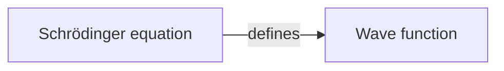

# Markdown Document Architecture

> **Status:** Agreed specification — **not implemented**. §3 describes what exists today; everything
> from §4 onward is the target.  
> **Authority:** Canonical source for the Knogra Markdown document and the three operations on it —
> Build, Update, and Export. Supersedes the Mermaid import/export material in
> [architecture.md](architecture.md) §3.3 once implemented.  
> **Out of scope:** The workspace file. Saving and opening a workspace is an unrelated format with
> an unrelated purpose — see [Workspace architecture](workspace-architecture.md).  
> **Last updated:** 2026-08-11  
> **Related:** [Documentation map](README.md), [Architecture](architecture.md),
> [Workspace architecture](workspace-architecture.md),
> [Mermaid Fan Layout](mermaid-fan-layout.md) (layout model — unchanged by this work)

---

## 1. Purpose

The diagram stabilises early; the prose keeps changing. Refreshing prose today means re-importing
the whole file and losing every scene, layout and design decision — the work that took longest is
the work that gets destroyed.

The replacement: one composable artefact, a strict identity model, and a second operation that
updates an existing graph's content without touching its structure or design.

---

## 2. Terminology

| Term | Definition |
|------|------------|
| **Knogra Markdown document** | A `.md` file carrying an optional Mermaid diagram plus optional `# Knogra …` prose sections |
| **Content section** | One `# Knogra …` heading and its entries |
| **Build** | Convert a document into a **new** graph. Replaces the workspace |
| **Update** | Apply a document's content to the **open** graph. Structure never changes |
| **Export** | Project the open graph into a document |
| **`externalId`** | The id an element is known by in external documents (§6) |

- **Not "import".** The old *initial* / *auxiliary import* both contained the word that also names
  opening a workspace file — which is what made two subsystems read as one.
- **Not "merge".** Nothing is reconciled between equals: one side is authoritative content, the
  other is a graph receiving it.
- **"Export" here always means export as Markdown.** Writing a workspace to a file is *Save*
  ([Workspace architecture](workspace-architecture.md)).

### 2.1 A Markdown document is never a backup

It carries no positions, scenes, designs, themes, viewports, folds or paths. The backup is the
workspace file, and this must be visible in the UI, not only here.

| Data | Workspace file | Markdown document |
|---|---|---|
| Nodes (title, tags, properties) | ✔ | ✔ |
| Edges + edge types | ✔ | ✔ (type name as label) |
| Notes (`source: 'note'`) | ✔ verbatim | ✔ round-trips |
| AI chat + tutorial messages | ✔ verbatim | ✔ export-only, ignored on read |
| Note image bytes | ✔ | link only |
| Scenes, positions, designs, folds | ✔ | ✘ |
| Themes, background images | ✔ | ✘ |
| Paths, shelf, settings, app state | ✔ | ✘ |

The workspace file restores every message exactly, because it is a dump of ChatStore. Markdown is
the **only** artefact that partitions messages by `source`, resolves them by id, and writes back a
subset.

---

## 3. Current state (implemented)

Facts that constrain the design. Each is cited where it bites.

**Pipeline.** Import ([`mermaid.ts`](../src/storage/mermaid.ts)): parse → selection dialog →
`createImportedGraph()` → `clearAllData()` → write → reload, destructive by construction.
`createImportedGraph()` ([`import-builder.ts`](../src/storage/mermaid/import-builder.ts)) is a pure
function — the good part of the current design. Export emits only nodes and edges with positional
ids `N1…Nn` and no content sections, so there is no round trip today.

**Content sections** and where they land:

| Section | Lands in |
|---|---|
| `# Knogra equations` | `node.properties.equation` |
| `# Knogra tags` | `node.tags` |
| `# Knogra comments` | `node.properties.comment` |
| `# Knogra notes` | conversation message, **`source: 'tutorial'`** |
| `# Knogra tutorial` | conversation message, `source: 'tutorial'` |

Equations and tags are one line, `<id>: value`. Prose opens with `<id>:` and runs verbatim until
`</note>`; an entry left open at section end is closed leniently; last wins on duplicates. `<id>`
matches `[A-Za-z0-9_-]+` and names a diagram node in the same file. A section runs to the next
Knogra heading or EOF. A `flowchart` / `graph` header is required — a metadata-only file throws.

**There is no identity.** `createImportedGraph()` builds `idByMermaidId` and **discards it**. That
is the root cause — not that Update was never written, but that the information it needs was never
persisted. Notes already have stable identity: `ChatMessage.id` persists.

**The message model** — the obvious assumption is wrong:

| What | `role` | `source` |
|---|---|---|
| Question to the AI | `user` | `ai` |
| AI reply | `assistant` | `ai` |
| Note typed in the note editor | **`user`** | `note` |
| Prose imported from a document | `assistant` | `tutorial` |
| Legacy | either | *absent* |

`source` selects the renderer, varies the context menu, and decides what **Clear messages** can
remove — it offers *AI* (`ai` + legacy) and *Notes* (`note`), so `tutorial` cannot be bulk-removed
at all. **Any rule phrased in terms of `role` selects the wrong set:** notes are `role: 'user'`.

**Two write hazards.** GraphSaver's `#saveContent()` re-extracts `title`, `tags` and `properties`
from live `cy` every sync, so a store-only write is silently reverted for every node in the open
scene. And the node editor rebuilds the property bag on save: `advanced-tab.ts` strips `equation`
and `comment` from the displayed JSON, then `#composeProperties` re-adds those two *from the Content
tab* — they survive only because a tab owns them (§6.3).

---

## 4. The document

### 4.1 Composability

A document may carry any combination of: a **Mermaid flowchart**, and the **equations**, **tags**,
**comments**, **notes** and **ai chat** sections. Every part is optional, including the diagram.

That composability is what gives the document its three uses: authoring a graph, refreshing its
prose, and reading or discussing it outside the app.

### 4.2 Shape

````markdown
# Knogra Graph — Quantum Mechanics

<!-- knogra:doc v1 -->



## Knogra equations
n-1754-901-234-567: `i\hbar\frac{\partial}{\partial t}\Psi = \hat{H}\Psi`

## Knogra tags
n-1754-901-234-567: physics, core, equation

## Knogra comments
n-1754-901-234-567: Needs a worked example for the time-independent case.
</note>

## Knogra notes
n-1754-901-234-567:msg-1754901234-ab7f3c2:
The fundamental equation of motion — the role Newton's second law plays classically.
</note>

n-1754-901-234-568:intro:
An author-chosen label, so re-running this document replaces the note
instead of adding a second copy.
</note>

## Knogra ai chat
n-1754-901-234-567:msg-1754901234-cd9e1f4:user:
Why does the wave function collapse on measurement?
</note>

n-1754-901-234-567:msg-1754901234-ef5a8b1:assistant:
Collapse is a postulate rather than a derived result…
</note>
````

### 4.3 Grammar

As §3, plus:

- **Notes:** `<nodeId>:<noteId>:` + body + `</note>`. `<noteId>` is **mandatory** (§6.2).
- **AI chat:** `<nodeId>:<messageId>:<role>:` + body + `</note>`, `<role>` = `user` | `assistant`.
  Three parts because a chat log without its questions is half a conversation. **Export-only and
  discarded on read** — which is what lets the key be strict with no resolution rule attached.
  Always the last section.
- All id parts match `[A-Za-z0-9_-]+`; Knogra `NodeId`s and `MessageId`s already satisfy it, so no
  escaping is needed.
- **Every Knogra heading — including the discarded `# Knogra ai chat` — must be registered** in the
  single alternation that today is `KNOGRA_METADATA_HEADING`. That one regex is both the section
  terminator and the diagram-body scrubber, so an unregistered heading is swallowed by the preceding
  section and leaks into the diagram.
- `<!-- knogra:doc v1 -->` marks the document version. Absent in hand-written files, treated as v1.
- **No `flowchart` / `graph` header is required.** A document with no diagram parses to zero nodes
  and edges plus whatever content it carries — the normal input to Update.

---

## 5. Operations

| | **Build** | **Update** |
|---|---|---|
| Result | Creates a new graph, replacing the workspace | Changes content in the graph already open |
| Diagram | Read — builds nodes, edges, scenes, layout | **Ignored entirely** |
| Content sections | Written onto the newly created nodes | Written onto existing nodes, matched by id |
| Structure | Created from the diagram | **Never changed** — no node or edge added or removed |
| Identity requirement | None — ids are recorded as `externalId` | Every entry must resolve by id (§6) |
| Configuration | Anchor, depth, layout, scene generation, edge-label mapping, which sections to apply — as today | Which sections to apply, plus add-vs-replace for notes |

Running the same document as a Build is always available; the two differ in what they may touch,
not in what they read.

### 5.1 Build

Unchanged in substance from today's Mermaid import, with three changes:

1. **Stamps `properties.externalId`** on every node, from the document's own node id (§6.3).
2. **`# Knogra notes` produces `source: 'note'`**, not `'tutorial'` — without this the
   round-trippable section is empty on every newly built graph (§5.8). Only the legacy
   `# Knogra tutorial` section still produces `'tutorial'`.
3. **The diagram is optional at parse time** (§4.3), though a Build with no diagram is refused.

Layout, scene slicing, edge mapping and the options dialog are untouched;
[mermaid-fan-layout.md](mermaid-fan-layout.md) is unaffected.

### 5.2 Update — scope

**Content only.** No node or edge is created, removed, or re-linked; an entry naming no known node
is reported, not created (§6.1). That is what keeps Update free of every placement, layout and
scene-membership question. When a document carries both a diagram and content sections, **Update
ignores the diagram entirely.**

### 5.3 Update — node fields

| Section | Document has a value | No entry | Empty value |
|---|---|---|---|
| Equation | Replace | Leave untouched | Skip |
| Comment | Replace | Leave untouched | Skip |
| Tags | **Replace the whole set** | Leave untouched | Skip |

- **Empty means skip, never clear** — a stray blank line must not wipe a comment. Clearing is done
  in the app.
- **Tags replace, not combine.** Two accepted consequences: computed `leaf` / `branch` tags from
  Build are lost unless the document carries them, and since tags drive style copying, replacing
  them can change appearance. Tags are the one section with visual effect, so the preview says so.
- **Design is never touched.** Build sets `design = equationDesignId` for nodes with equations;
  Update must not — that is precisely the work being protected.

### 5.4 Update — notes

Matching and **Add missing notes** are in §6.2; the guard in §6.5. The rest:

| Question | Rule |
|---|---|
| Does a replaced note keep its `source`? | **Yes** — an AI article you edited is still the same note |
| What `source` does a *new* note get? | Always `note`. The document cannot declare one (§4.3), and a note from a file the user edited by hand *is* hand-written |
| Do a replaced note's images survive? | **Yes** — replacing prose must not silently drop attachments |
| Where does a new note land? | Appended after existing chat history; notes and chat share one ordered list |
| Is a note deleted when the document omits it? | **Never** |

### 5.5 Update — settings

Presented at run time, not persisted as global preferences:

| Setting | Default |
|---|---|
| Sections to apply (equations / comments / tags / notes) | all on |
| Add missing notes | **off** — update-only is the safe default |
| Save workspace to file first | **on** |

**Save-first is not decoration.** Update replaces tag sets, overwrites equations and comments, and
replaces note bodies, and there is no undo. The preview shows what *will* happen but offers no
recovery after Apply — save-first is the only reason whole-plan approval is safe.

**Refused in View mode.** Update is an in-place graph content mutation, which is what View mode
exists to prevent ([architecture.md](architecture.md) §3.10). Opening a workspace file stays
available there because it *replaces* the workspace rather than editing it — different act,
different reason. Per §3.10 the refusal lives at the operation's entry point; greying the menu item
is an affordance, never the enforcement.

### 5.6 Update — the preview

Nothing is written until the user approves. Produced by the planner, before any store access:

```
Update graph from document

Matched 47 of 52 nodes — 43 by node id, 4 by external id

Will change
  equations   12 replaced      tags     18 replaced  ← may change appearance
  comments    31 replaced      notes    38 replaced, 3 added

Not matched (nothing will change)
  5 document entries name no known node · N7 · N12 · …

  [x] Save workspace to file first        [ Cancel ]  [ Apply ]
```

**Whole-plan approval — one Apply, one Cancel.** Per-row selection is a lot of UI for a rare need,
and the escape hatch exists already: cancel, fix the document, re-run. The preview's job is to
surface unmatched entries before they become a silent no-op.

### 5.7 Update — write path

The applier writes through `graphStore.updateNode` and `chatStore.saveConversation`, then reloads —
the same strategy the existing importers use, and the only one GraphSaver cannot clobber. Live-`cy`
mirroring without a reload is a possible later refinement, out of scope.

Two rules make it hold:

- **Suspend GraphSaver before writing, and never resume.** "Write then reload" alone is not enough:
  saves are debounced by 500 ms, so a save queued before the applier ran can fire between the store
  write and the navigation and overwrite every node in the open scene from stale Cytoscape data.
  `graphSaver.suspend(reason)` clears the pending timeout as well as blocking new ones.
- **Preserve app state.** Build calls `clearAppState()`, `saveLastSceneId()` and
  `requestFitOnNextOpen()` because it creates a new graph with a new anchor. Update must do **none**
  of them — the user must land back on the same scene, in the same mode, with the path session
  intact. The easiest thing to get wrong by copying the neighbouring function.

### 5.8 Export

- **Node ids: the real `NodeId`**, used directly as the diagram node id — not positional `N{index}`
  as today. Knogra ids already fit the identifier grammar, so every exported document is
  self-identifying and exactly matchable.
- **Note ids: the real `MessageId`.**
- **Messages are partitioned by `source`, never by `role`** (§3):

  | Section | Selects | Behaviour |
  |---|---|---|
  | `# Knogra notes` | `source === 'note'` | The **only** writable section — read back by Update |
  | `# Knogra ai chat` | `'ai'`, `'tutorial'`, or absent | Both roles, chronological. Export-only; ignored on read |

  `tutorial` groups with `ai` because it *is* pre-recorded AI chat — it renders through the
  AI-message path and exists only in the legacy tutorial graph. Losing it on round trip is intended.

  One writable section is what removes the need for a `source` field in the grammar, and it removes
  the main round-trip instability: re-reading an exported document can no longer duplicate AI chat.
- **Which sections are written is a user choice** — a checkbox per section. All default on except
  **ai chat**, which defaults **off**: it can dwarf the rest of the file.
- **No `source` and no timestamps** are written; the workspace file holds them verbatim.
- **Images:** links where `sourceUrl` exists; uploaded images with no link are omitted and counted.
  A base64 data URL is unreadable to humans and models alike.
- **Menu label:** *Export as Markdown*, not "Export Mermaid".

---

## 6. Identity

Each document entry names something in the graph, and the app must decide which node — and for
notes, which note — it refers to. That decision is made **only by id**. Identity governs **Update**;
Build needs none, since it creates everything it names.

### 6.1 Naming a node

The `<id>` in every section is checked in this order:

1. **Real `NodeId`** — present when the document was exported by Knogra, or typed correctly by hand.
2. **`node.properties.externalId`** — the id the node carried in the document it was built from.

No match → **reported and skipped**. Nothing is created, nothing is guessed.

**Titles are never used, anywhere.** Title matching fails silently — a rename on either side breaks
the link with no error, and duplicate titles are possible since uniqueness is only warned. An
operation that quietly writes prose onto the wrong node is worse than one that refuses.

### 6.2 Naming a note

A node holds many notes, so naming the node is not enough. The key is `<nodeId>:<noteId>:`.

`<noteId>` is **mandatory** — optional would make `n-123: Note: this matters` parse `Note` as a note
id. It resolves **within the named node only**, against the real `MessageId` first, then
`message.externalId` (an author-chosen label): `intro` under node A and under node B are different
notes.

| Node found | Note found | Result |
|---|---|---|
| ✔ | ✔ | **Replace** that note's content |
| ✔ | ✘ | Per **Add missing notes**: create it with the document's `noteId` as its `externalId` — or skip |
| ✘ | — | Report, skip |

**Add missing notes** exists so an update-only run cannot add anything; without it a drifted
document silently accumulates duplicates.

### 6.3 `externalId`

- **Nodes:** `node.properties.externalId: string`, written at Build from the source document's node
  id.
- **Notes:** `ChatMessage.externalId?: string`, written when Update creates a note, from the
  document's `noteId`. Purpose is idempotency — run the same document twice and the note is
  replaced, not duplicated.
- Not named `mermaidId`: the format is no longer Mermaid-specific.
- **Hidden from the node editor's advanced tab *and* carried through on save.** Hiding alone is not
  sufficient and the `comment` precedent does not transfer (§3): a property hidden but owned by no
  tab is **deleted on every save**. The rule is one declared list of *system properties* — the
  advanced tab strips them for display, `#composeProperties` re-attaches them from the original
  node. Without it, opening the editor and pressing Save silently breaks matching, which is the
  exact failure mode §6.1 exists to prevent.

### 6.4 Bootstrap: export first

Every existing graph was built before `externalId` (§3), so **pointing an old source file at an
old graph matches nothing** — including every published demo. Accepted, not worked around:

1. Export the graph as a Markdown document — written with real `NodeId`s and `MessageId`s.
2. Move the prose into it, or edit it in place.
3. Run it as an Update. From then on it round-trips indefinitely.

**Graphs whose prose arrived by Markdown import need one extra step.** Today both prose sections are
stamped `source: 'tutorial'` (§3), and `tutorial` exports into the AI-chat section, which Update
ignores. For those graphs — every Markdown-built graph in the catalog — the path above recovers
nothing, and hand-moving the prose with **Add missing notes** on would leave the original alongside
the new copy. `tutorial` messages cannot be bulk-removed either (§3).

Remedy: a **dev-only relabel helper** on the existing `knogra.*` diagnostics surface that rewrites
`source: 'tutorial'` → `'note'` across the open workspace, run once per existing graph before its
first export. No UI, no menu entry, no migration machinery; the shipped tutorial graph is never run
through it. Build stops producing the mismatch (§5.1), so it is needed only for graphs that exist.

No title-matching repair command is provided — reintroducing the mechanism for a bootstrap would
reintroduce it as a habit.

### 6.5 The notes guard

The notes section is **refused outright** when no note id resolves to an existing note. That is
indistinguishable from pointing a document at the wrong workspace, and with **Add missing notes** on
it would duplicate the entire note set in one action. The refusal names the cause and points at
§6.4; other sections still run.

**Absolute, not proportional** — a percentage threshold introduces an arbitrary number, and partial
mis-targeting is already surfaced by the preview.

---

## 7. Constraints and no-goals

**Constraints**

1. No new dependencies. Browser-only.
2. **The GraphSaver rule** (§3): any in-place mutation of node content either mirrors into live
   `cy`, or suspends GraphSaver and then reloads. A reload alone is not enough (§5.7).
3. Validation stays informational, never a hard block.
4. Old documents keep working for Build. They cannot be used for Update — see §6.4.

**No-goals**

- Update never changes structure — no node or edge created or removed.
- No deletion semantics; absence of an entry never removes anything.
- No title matching, anywhere.
- No round-trip fidelity beyond the notes section.
- No combining of two workspaces. No incremental or continuous sync.
- No per-row cherry-picking in the preview.
- Edges have no identity: edge titles, tags and types are not updatable from a document.

---

## 8. Module architecture

### 8.1 Layout

```
src/storage/markdown/            ← renamed from mermaid/
├── document/
│   ├── sections.ts        parse + serialize the `# Knogra …` sections  [pure]
│   ├── diagram.ts         parse + serialize the Mermaid flowchart      [pure]
│   ├── document.ts        whole-document facade; owns the model type   [pure]
│   └── status.ts          per-section presence helpers, moved out of the dialog
├── build/                 document → new graph
│   ├── builder.ts         (today's import-builder.ts)                  [pure]
│   ├── layout/            radial, fan, flow, shared — unchanged        [pure]
│   ├── scene-slice.ts     unchanged                                    [pure]
│   └── edge-mapping.ts    unchanged                                    [pure]
├── update/                document → open graph
│   ├── identity.ts        id resolution (§6)                           [pure]
│   ├── plan.ts            planUpdate(…) → UpdatePlan                   [pure]
│   └── apply.ts           writes to graphStore / chatStore             [IO]
├── markdown.ts            orchestration (today's mermaid.ts)
└── dialogs/               build options, export sections, update preview [DOM]
```

**Why `markdown/` and not `mermaid/`.** The folder already parses five non-Mermaid sections, and
under this design the diagram becomes optional — the old name describes one optional part of the
artefact. The rename is mechanical but broad, so it lands as its own commit.

**The document model stays here**, in `document/document.ts`. Promoting it to `core/` was only
needed when format and graph-construction lived in separate subsystems; `build/` and `document/`
are siblings in one module, so `core/` gains nothing.

### 8.2 Dependency direction

`markdown/` depends on `core/`, `config/`, the stores, and **`workspace/`** — it calls
`exportWorkspace()` for save-first and reuses `transfer.ts`. One-directional: **nothing in
`workspace/` imports from `markdown/`.**

Nothing in `features/` or `ui/` is imported. This sits inside the "explicit storage workflow"
exception already named in [architecture.md](architecture.md) §3.1. DOM under `storage/` is
pre-existing debt, continuing the pattern of `storage/workspace/dialogs.ts`.

### 8.3 Modified outside the module

| File | Change |
|---|---|
| [`core/chat-types.ts`](../src/core/chat-types.ts) | `externalId?: string` on `ChatMessage` |
| `config/` | The declared system-property list (§6.3) |
| `ui/components/node-editor/advanced-tab.ts` | Strips system properties from the raw-JSON editor |
| `ui/components/node-editor/node-editor.ts` | `#composeProperties` re-attaches them, so Save cannot delete `externalId` |
| `ui/components/node-editor/node-editor-types.ts` | Documents that `AdvancedTabValues.properties` excludes system properties |
| [`ui/context-menu/canvas-menu.ts`](../src/ui/context-menu/canvas-menu.ts) | Menu entries: *Build graph from Markdown…*, *Update graph from document…*, *Export as Markdown…* |

Nothing else changes. The list of subsystems that must stay untouched is in the
[redesign plan](export-import-redesign-plan.md).

---

## 9. Compatibility

| Input | Today | Target |
|---|---|---|
| Old document, no content sections | import | **Build**; stamps `externalId` |
| Old document, with content sections | import | **Build**; stamps `externalId`, notes become `source: 'note'` |
| Old document used for Update | — | Matches nothing; see §6.4 |
| New document (Knogra-exported) | — | **Build** *or* **Update** |
| Content-only document (no diagram) | parse error | **Update** |

**Deprecated:** Mermaid export (positional ids, no content sections) is replaced by document export
(§5.8). The `# Knogra tutorial` section is retained on the **legacy Build path** only. Build no
longer stamps imported prose as `source: 'tutorial'` (§5.1).
