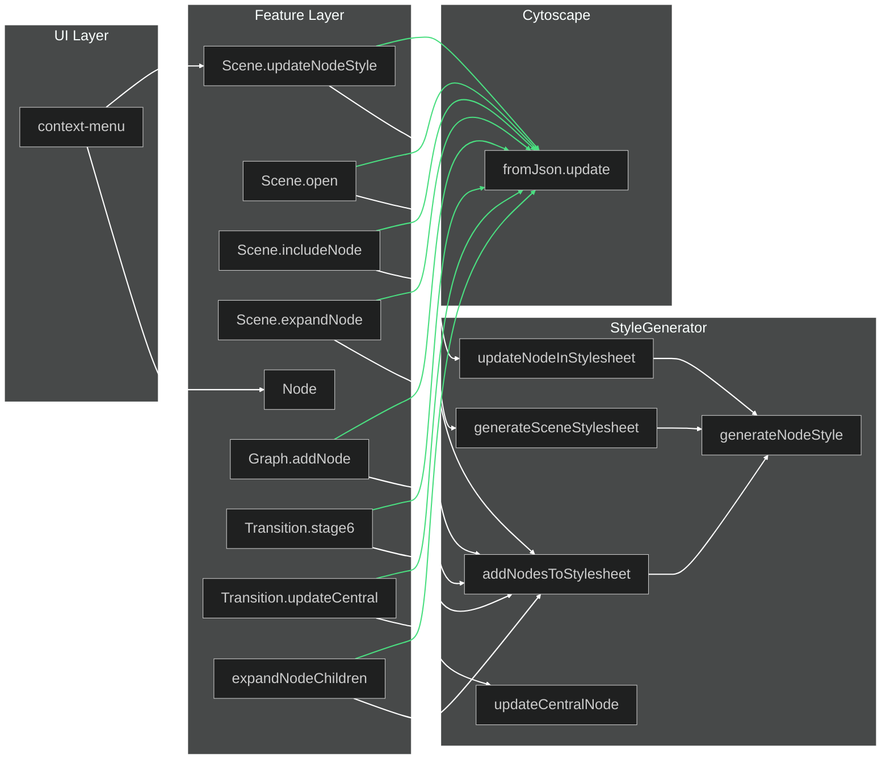

# Node Styling Architecture

This document describes the correct architecture for node styling in Knogra.

## Principles

1. **UI layer only delegates** — no business logic in context-menu or other UI components
2. **Features own their domain** — Node handles node content, Scene handles scene-specific properties
3. **StyleGenerator is the only style authority** — all styling goes through StyleGenerator methods
4. **Always use fromJson().update()** — never use selector().style().update() as it appends to end

## Data Ownership

| Property | Owner | Feature |
|----------|-------|---------|
| title, tags, properties | Node entity | `Node.update()` |
| design, scale, position | Scene entity | `Scene.updateNodeStyle()` |

## StyleGenerator Methods

| Method | Purpose | When to Use |
|--------|---------|-------------|
| `generateSceneStylesheet()` | Full scene load | `Scene.open()` |
| `addNodesToStylesheet()` | Add new nodes | `Scene.includeNode()`, `Graph.addNode()`, transitions |
| `updateNodeInStylesheet()` | Update existing node | `Scene.updateNodeStyle()` |
| `updateCentralNodeInStylesheet()` | Update central node highlight | `Transition.#updateCentralNodeStyle()` |
| `generateNodeStyle()` | Generate single style | Called internally by above methods |

## Call Flow Diagram



## Correct Stylesheet Order

Cytoscape applies styles in order — later rules override earlier ones (with equal specificity).

```
1. node[id="n1"] styles     ← specific node styles (first)
2. node[id="n2"] styles
3. node[id="centralNodeId"] ← central node highlight
4. node:selected            ← selected state (must come after node styles)
5. edge                     ← edge styles
```

**Critical:** Node-specific styles must come BEFORE `:selected` so that selection highlighting works.

## Key Rules

### ✅ DO
- Call `Scene.updateNodeStyle()` for design/scale changes
- Call `Node.update()` for content changes (title, tags, properties)  
- Use `addNodesToStylesheet()` for adding new nodes
- Use `updateNodeInStylesheet()` for updating existing nodes
- Always apply via `cy.style().fromJson(stylesheet).update()`

### ❌ DON'T
- Put StyleGenerator calls in UI layer
- Use `cy.style().selector().style().update()` — appends to end, breaks order
- Mix node content and scene properties in a single update call

## Example: Node Editor Save

```typescript
// In context-menu.ts (UI layer)
this.#nodeEditor.show(nodeId, nodeData, design, context, async (id, contentUpdates, designUpdates, scaleUpdate) => {
  // Update node content (title, tags, properties)
  await this.#features.node.update(id, contentUpdates);
  
  // Update scene-specific style (design, scale)
  await this.#features.scene.updateNodeStyle(id, {
    design: designUpdates,
    scale: scaleUpdate
  });
});
```
